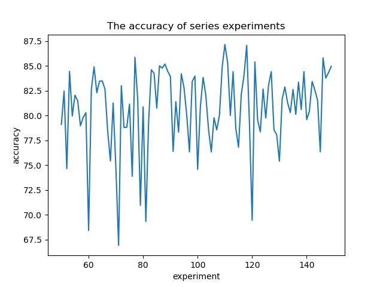
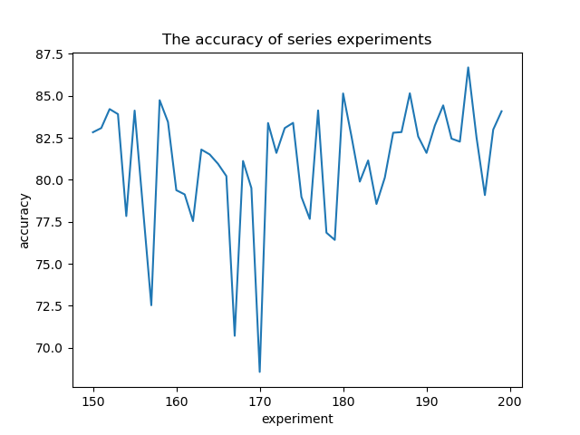

# AICAS
## Quick Start
You can generate the config *.yaml by running the generate_model.py in models.
Then execute the instruction to train.
```sh
python3 train --config ./config/**.yaml --dataset cifar10
```
## Activation
pass
## The result of trainning
### Benchmark
|model|Flops|Params|acc|
|-|-|-|-|
|vgg11| 153.37M | 9.23M | 91.23|
|vgg13| 229.26M | 9.41M | 93.24|
|vgg16| 314.31M | 14.72M | 92.52|
|vgg19| 399.35M | 20.04M | 92.93|
|repvgg-A0(lr=0.1)| 460.09M | 26.30M | 91.94|
|repvgg-A0(lr=0.01)| 460.09M | 26.30M | 90.51|
|repvgg-A1(lr=0.1)| 807.43M | 44.55M | 92.36|
|repvgg-A1(lr=0.01)| 807.43M | 44.55M | 90.07|
|repvgg-A2| 1797.01M | 96.25M | 92.28|
|repvgg-B0| 978.42M | 51.77M | 92.30|
|repvgg-B1| 3870.45M | 199.05M | 92.40|

### good model
|NO.|layer|ratio|op|max|datset|flops|params|Acc|
|-|-|-|-|-|-|-|-|-|
|506|1-2-1-2-1|1.0-1.0-1.0-1.0-1.0|vgg-vgg-repvgg-vgg-vgg|False-True-False-True-True|cifar10|129.18|7.86|92.99|
|528|1-4-4-7-1|1.0-1.0-1.0-1.0-1.0|repvgg-repvgg-vgg-repvgg-vgg|False-False-False-False-True|cifar10|138.75|5.69|92.44|
|559|2-3-4-2-4|1.0-1.0-1.0-1.0-0.25|repvgg-vgg-repvgg-repvgg-vgg|False-True-True-False-True|cifar10|118.17|2.29|92.64|
|577|2-3-2-2-2|0.75-0.75-1.0-1.0-0.5|repvgg-repvgg-vgg-vgg-vgg|False-False-True-False-False|cifar10|70.446|2.358|92.08|
|587|2-2-4-4-4|1.0-1.0-1.0-0.5-0.625|repvgg-vgg-vgg-vgg-repvgg|False-False-False-False-False|cifar10|113.693|4.359|92.02|
|622|2-3-4-1-2|1.0-1.0-1.0-1.0-0.125|repvgg-repvgg-repvgg-vgg-vgg|False-True-True-True-True|cifar10|106.335|1.147|92.25|

|model|Flops|Params|
|-|-|-|
|vgg11|153.37M|9.23M|
|vgg13|229.26M|9.41M|
|vgg16|314.31M|14.72M|
|vgg19|399.35M|20.04M|
|repvgg-A0|460.09M|26.30M|
|repvgg-A1|807.43M|44.55M|
|repvgg-A2|1797.01M|96.25M|
|repvgg-B0|978.42M|51.77M|
|repvgg-B1|3870.45M|199.05M|
|repvgg-B2|6043.93M|310.97M|
|repvgg-B3|8668.27M|439.88M|
|after deploy|||
|repvgg-A0|411.863808M|23.646986M|
|repvgg-A1|723.733248M|40.058634M|
|repvgg-A2|1612.894848M|86.569098M|
|repvgg-B0|877.089408M|46.549642M|
|repvgg-B1|3476.453376M|179.057674M|
|repvgg-B2|5430.84288M|279.76321M|
|repvgg-B3|7791.023616M|395.761674M|
### NO.50-NO.149
The 100 models are mixed with repvgg and vgg, and the weight decay is 1e-4 and 5e-4 respectively.

 
### NO.150-NO.199
NO.150-NO.180 every op is vgg

NO.180-NO.200 every op is repvgg

And NO.180-NO.189 weight decay is 1e-4, NO.190-N0.199 weight decay is 4e-5

 

|NO.|layer|ratio|op|max|flops|Acc|
|-|-|-|-|-|-|-|
|rep|2-2-2-2|0.5-0.5-0.5-0.5|repvgg-repvgg-repvgg-repvgg|False-False-False-False||85.45%|
|vgg|2-2-2-2|0.5-0.5-0.5-0.5|vgg-vgg-vgg-vgg|False-False-False-False||88.88%|
|0|2-2-6-1|0.5-0.875-1.0-0.875|repvgg-repvgg-vgg-vgg|False-True-False-False||83.52%|
|1|1-1-5-2|0.125-0.75-0.625-0.625|vgg-repvgg-repvgg-vgg|False-False-False-True||90.22%|
|2|1-4-1-1|1.0-0.875-0.625-0.875|repvgg-vgg-repvgg-repvgg|True-False-True-True||82.11%|
|3|1-1-4-2|0.25-0.5-1.0-0.125|vgg-repvgg-vgg-repvgg|True-False-True-False||70.85%|
|4|2-4-11-2|0.375-0.375-0.25-1.0|repvgg-vgg-vgg-vgg|True-True-True-True||76.98%|
|5|1-1-10-1|0.625-0.125-0.25-0.75|vgg-vgg-repvgg-vgg|False-True-True-True||89.36%|
|6|2-3-1-2|0.5-0.625-0.375-0.125|vgg-vgg-vgg-repvgg|True-True-False-True||79.23%|
|7|1-1-8-1|0.375-0.125-1.0-0.125|repvgg-vgg-vgg-vgg|False-True-False-True||80.19%|
|8|1-3-4-1|1.0-0.75-0.625-1.0|vgg-vgg-vgg-repvgg|False-True-True-True||92.65%|
|9|1-4-14-1|0.875-0.75-0.5-0.375|vgg-vgg-vgg-repvgg|True-False-False-True||83.58%|
|10|2-1-2-1|1.0-0.75-0.375-0.625|vgg-repvgg-repvgg-repvgg|False-True-True-True|||
|11|1-4-3-2|0.375-0.75-0.125-0.875|vgg-repvgg-repvgg-repvgg|True-False-False-True|||
|12|1-2-4-6-1|0.125-0.125-0.625-0.5-0.375|vgg-vgg-repvgg-vgg-vgg|False-False-False-False-False||Nan,75.24%,78.33%|
|13|1-1-2-12-1|0.5-0.5-0.75-0.5-0.75|vgg-vgg-vgg-repvgg-vgg|False-True-True-True-False||Nan,81.94%|
|14|1-2-3-9-1|0.625-0.625-0.25-0.25-0.5|repvgg-repvgg-vgg-repvgg-vgg|False-True-False-False-False||Nan,84.80%|
|15|1-1-1-7-1|0.375-0.375-0.25-0.75-0.25|vgg-repvgg-vgg-repvgg-repvgg|False-True-True-False-True||Nan,80.99%|
|16|1-1-1-5-1|1.0-1.0-0.75-1.0-0.375|repvgg-vgg-vgg-repvgg-vgg|False-False-True-False-False||Nan,70.29%|
|17|1-2-2-2-1|1.0-1.0-0.375-0.875-0.875|repvgg-vgg-vgg-repvgg-repvgg|False-False-True-True-False||Nan|
|18|1-1-3-9-1|0.375-0.375-0.5-0.125-0.625|repvgg-vgg-repvgg-vgg-vgg|False-True-True-False-True|||
|19|1-1-3-2-1|1.0-1.0-0.25-0.25-0.125|vgg-vgg-vgg-vgg-vgg|False-False-False-True-True||87.76%|
|20|1-2-4-1-1|0.375-0.375-1.0-0.5-0.375|vgg-vgg-vgg-vgg-vgg|False-True-True-False-False||88.58%|
|21|1-1-2-12-1|1.0-1.0-0.25-0.375-0.75|vgg-vgg-vgg-vgg-repvgg|False-True-True-False-True||81.21%|
|22|1-1-2-9-1|0.375-0.375-0.25-0.375-0.75|vgg-vgg-vgg-vgg-repvgg|False-False-True-True-False||74.34%|
|23|1-2-4-11-1|0.25-0.25-0.375-0.5-0.5|repvgg-vgg-vgg-vgg-vgg|False-False-False-False-True||Nan|
|24|1-2-1-13-1|1.0-1.0-0.125-0.625-0.625|repvgg-vgg-repvgg-vgg-repvgg|False-True-False-False-True||Nan|
|25|1-2-4-1-1|0.875-0.875-0.5-1.0-0.625|vgg-vgg-repvgg-repvgg-vgg|False-True-True-False-True||Nan|
|26|1-1-3-7-1|0.625-0.625-0.375-0.625-0.125|repvgg-vgg-repvgg-vgg-vgg|False-False-False-False-False||Nan|
|27|1-2-3-13-1|0.5-0.5-0.5-0.125-0.375|vgg-repvgg-repvgg-repvgg-vgg|False-False-True-False-True||Nan|
|28|1-2-2-7-1|0.125-0.125-0.625-0.75-0.875|vgg-repvgg-repvgg-vgg-vgg|False-True-False-False-False||Nan|
|29|1-2-1-5-1|0.125-0.125-0.375-0.75-0.75|vgg-vgg-repvgg-vgg-repvgg|False-True-True-True-True||Nan|
|30|1-1-2-6-1|0.125-0.125-0.375-0.875-0.75|vgg-vgg-vgg-vgg-vgg|False-True-True-True-False||70.3%p|
|31|1-2-3-1-1|0.25-0.25-0.375-0.875-0.75|repvgg-vgg-vgg-vgg-repvgg|False-True-False-True-True||Nan|
|32|1-2-4-3-1|0.375-0.375-0.125-0.625-0.125|repvgg-repvgg-repvgg-repvgg-repvgg|False-True-True-False-False||Nan|
|33|1-1-1-1-1|0.125-0.125-1.0-0.5-0.125|repvgg-repvgg-repvgg-vgg-vgg|False-False-True-True-True||Nan|
|34|1-1-3-12-1|0.125-0.125-0.5-1.0-0.125|repvgg-repvgg-vgg-vgg-repvgg|False-False-False-True-True||Nan|
|35|1-2-3-5-1|0.25-0.25-0.625-0.625-0.375|repvgg-repvgg-vgg-repvgg-repvgg|False-True-True-True-False||Nan|
|36|1-1-3-6-1|0.125-0.125-0.5-0.5-0.375|vgg-vgg-repvgg-repvgg-repvgg|False-False-True-False-True||Nan|
|37|1-2-2-14-1|0.5-0.5-0.75-0.625-0.375|vgg-repvgg-repvgg-repvgg-repvgg|False-True-False-True-False||Nan|
|38|1-1-3-12-1|0.5-0.5-0.75-0.875-0.625|vgg-repvgg-vgg-vgg-vgg|False-False-True-True-True||Nan|
|39|1-2-3-10-1|0.25-0.25-1.0-1.0-0.125|repvgg-vgg-vgg-repvgg-vgg|False-False-False-True-True||Nan|
|40|1-2-3-13-1|0.625-0.625-0.375-0.625-0.875|vgg-vgg-vgg-vgg-vgg|False-True-True-True-False||82.65%|
|41|1-2-3-9-1|0.625-0.625-0.5-0.375-0.625|repvgg-vgg-vgg-vgg-repvgg|False-False-False-False-False||Nan|
|42|1-2-2-13-1|0.125-0.125-0.875-0.125-0.875|vgg-repvgg-repvgg-repvgg-repvgg|False-False-True-False-True||Nan|
|43|1-1-4-2-1|0.125-0.125-0.5-0.125-0.25|repvgg-repvgg-vgg-repvgg-vgg|False-True-True-False-True||Nan|
|44|1-2-2-10-1|1.0-1.0-0.625-0.125-0.75|repvgg-vgg-vgg-repvgg-vgg|False-False-True-False-False||Nan|
|45|1-2-2-2-1|0.25-0.25-0.625-0.25-0.125|repvgg-vgg-vgg-repvgg-vgg|False-True-True-False-False||Nan|
|46|1-1-2-7-1|0.375-0.375-0.875-0.875-0.375|vgg-vgg-vgg-vgg-repvgg|False-True-False-False-False||81.88%|
|50|1-2-3-8-1|0.25-0.25-0.625-1.0-0.375|repvgg-repvgg-repvgg-repvgg-repvgg|False-True-True-True-True|||
|51|1-2-3-3-1|0.5-0.5-0.375-0.625-0.25|repvgg-vgg-vgg-repvgg-vgg|False-False-True-True-True|||
|52|1-2-3-1-1|0.125-0.125-0.75-0.25-0.5|vgg-repvgg-vgg-repvgg-vgg|False-True-True-False-False|||
|53|1-2-4-2-1|0.5-0.5-0.75-1.0-0.75|vgg-vgg-repvgg-repvgg-repvgg|False-True-False-True-False|||
|54|1-1-1-10-1|0.75-0.75-0.75-0.75-0.625|vgg-vgg-repvgg-repvgg-repvgg|False-True-True-True-False|||
|55|1-1-2-12-1|0.875-0.875-0.75-1.0-1.0|repvgg-repvgg-repvgg-repvgg-repvgg|False-False-True-True-False|||
|56|1-1-1-2-1|0.5-0.5-1.0-0.125-0.75|repvgg-repvgg-vgg-vgg-repvgg|False-True-False-True-True|||
|57|1-2-1-6-1|0.375-0.375-0.625-0.5-1.0|repvgg-vgg-repvgg-vgg-repvgg|False-True-True-True-False|||
|58|1-1-1-7-1|0.5-0.5-0.625-1.0-1.0|vgg-vgg-vgg-repvgg-repvgg|False-True-False-True-False|||
|59|1-1-2-4-1|0.25-0.25-1.0-0.25-0.5|repvgg-repvgg-repvgg-repvgg-repvgg|False-False-True-False-False|||
|60|1-1-1-3-1|0.125-0.125-0.5-1.0-0.375|repvgg-vgg-repvgg-vgg-vgg|False-False-True-True-False|||
|61|1-2-2-9-1|0.625-0.625-0.125-0.25-1.0|vgg-repvgg-repvgg-vgg-vgg|False-False-True-True-True|||
|62|1-1-1-1-1|1.0-1.0-0.625-0.25-0.5|repvgg-vgg-vgg-repvgg-vgg|False-False-False-False-False|||
|63|1-1-4-8-1|0.5-0.5-0.875-1.0-0.625|repvgg-repvgg-vgg-vgg-repvgg|False-True-True-True-True|||
|64|1-2-4-4-1|0.5-0.5-1.0-0.75-0.5|repvgg-repvgg-vgg-repvgg-repvgg|False-True-True-False-True|||
|65|1-2-3-2-1|0.25-0.25-1.0-0.375-0.875|vgg-vgg-repvgg-repvgg-vgg|False-False-False-True-True|||
|66|1-2-1-5-1|0.625-0.625-1.0-0.25-0.5|vgg-vgg-vgg-repvgg-repvgg|False-False-False-True-True|||
|67|1-2-2-12-1|0.25-0.25-0.5-0.375-0.375|vgg-vgg-repvgg-repvgg-repvgg|False-True-False-True-False|||
|68|1-2-3-13-1|0.125-0.125-1.0-0.625-1.0|vgg-repvgg-vgg-vgg-vgg|False-True-True-True-True|||
|69|1-1-2-4-1|0.5-0.5-0.625-0.875-0.25|repvgg-repvgg-vgg-repvgg-vgg|False-False-False-True-False|||
|70|1-1-1-10-1|0.25-0.25-0.5-0.5-0.375|vgg-repvgg-repvgg-repvgg-repvgg|False-True-True-True-True|||
|71|1-2-2-7-1|0.125-0.125-0.125-1.0-1.0|repvgg-vgg-vgg-repvgg-repvgg|False-True-False-True-False|||
|72|1-2-4-5-1|0.25-0.25-0.75-0.625-0.75|vgg-repvgg-repvgg-repvgg-vgg|False-False-False-False-False|||
|73|1-1-3-12-1|0.875-0.875-0.125-0.375-0.875|vgg-repvgg-vgg-vgg-vgg|False-False-False-True-True|||
|74|1-1-1-4-1|0.375-0.375-0.625-0.625-0.125|repvgg-repvgg-vgg-repvgg-repvgg|False-False-False-True-True|||
|75|1-2-4-14-1|0.5-0.5-0.25-1.0-0.625|repvgg-vgg-repvgg-repvgg-vgg|False-False-True-True-False|||
|76|1-1-4-1-1|0.25-0.25-0.125-0.125-0.5|repvgg-vgg-vgg-repvgg-repvgg|False-False-False-True-False|||
|77|1-2-4-11-1|0.75-0.75-1.0-0.625-0.5|vgg-repvgg-repvgg-vgg-repvgg|False-False-True-False-False|||
|78|1-1-2-1-1|0.5-0.5-0.625-0.5-0.25|vgg-repvgg-vgg-repvgg-vgg|False-True-True-False-False|||
|79|1-1-1-10-1|0.125-0.125-0.5-0.25-0.875|repvgg-repvgg-repvgg-vgg-repvgg|False-True-True-True-True|||
|80|1-2-3-14-1|0.375-0.375-0.25-0.75-0.625|vgg-vgg-repvgg-repvgg-repvgg|False-False-True-False-False|||
|81|1-2-1-14-1|0.125-0.125-0.375-0.75-0.125|vgg-repvgg-vgg-repvgg-repvgg|False-True-True-True-False|||
|82|1-1-4-9-1|0.125-0.125-1.0-0.125-0.375|vgg-vgg-repvgg-repvgg-vgg|False-False-False-True-False|||
|83|1-2-2-2-1|0.75-0.75-0.625-0.125-0.625|vgg-vgg-vgg-vgg-vgg|False-True-False-True-True|||
|84|1-2-4-12-1|0.75-0.75-0.5-0.75-1.0|repvgg-vgg-vgg-repvgg-vgg|False-False-True-False-False|||
|85|1-1-2-6-1|0.5-0.5-0.625-1.0-1.0|repvgg-vgg-repvgg-repvgg-repvgg|False-True-True-True-False|||
|86|1-2-3-4-1|0.625-0.625-0.875-1.0-0.375|repvgg-repvgg-repvgg-vgg-repvgg|False-False-False-True-False|||
|87|1-2-1-9-1|0.875-0.875-0.5-0.125-0.75|repvgg-repvgg-vgg-repvgg-vgg|False-True-True-True-False|||
|88|1-2-3-5-1|0.625-0.625-1.0-0.125-0.625|vgg-vgg-repvgg-vgg-repvgg|False-False-True-False-False|||
|89|1-1-2-2-1|1.0-1.0-0.875-1.0-0.25|repvgg-repvgg-vgg-repvgg-vgg|False-True-False-True-True|||
|90|1-1-4-1-1|1.0-1.0-0.5-1.0-0.625|repvgg-repvgg-vgg-repvgg-vgg|False-True-True-False-False|||
|91|1-1-1-4-1|0.625-0.625-0.125-0.25-0.625|repvgg-repvgg-vgg-vgg-vgg|False-False-True-True-True|||
|92|1-1-3-3-1|0.25-0.25-0.875-0.75-0.75|repvgg-vgg-repvgg-vgg-repvgg|False-True-False-False-True|||
|93|1-2-4-6-1|0.375-0.375-0.125-0.75-1.0|repvgg-repvgg-repvgg-vgg-repvgg|False-True-True-True-False|||
|94|1-2-4-6-1|0.5-0.5-0.75-0.625-0.375|vgg-repvgg-vgg-repvgg-vgg|False-True-False-True-False|||
|95|1-1-3-14-1|0.875-0.875-1.0-0.625-0.5|repvgg-vgg-vgg-repvgg-repvgg|False-False-True-False-False|||
|96|1-1-1-2-1|0.375-0.375-0.875-1.0-0.25|vgg-repvgg-vgg-repvgg-vgg|False-False-False-True-False|||
|97|1-2-2-1-1|0.125-0.125-0.5-0.25-0.75|vgg-repvgg-repvgg-repvgg-vgg|False-False-True-True-True|||
|98|1-1-3-11-1|0.5-0.5-0.875-0.25-0.625|repvgg-repvgg-vgg-vgg-vgg|False-True-False-True-True|||
|99|1-2-2-9-1|0.75-0.75-0.125-0.75-1.0|vgg-repvgg-vgg-repvgg-repvgg|False-False-False-False-False|||
|100|1-1-1-9-1|0.125-0.125-0.375-0.875-0.625|repvgg-vgg-vgg-repvgg-repvgg|False-True-False-False-True|||
|101|1-2-4-13-1|0.25-0.25-0.625-0.5-0.5|repvgg-repvgg-repvgg-repvgg-vgg|False-False-True-False-True|||
|102|1-2-4-14-1|0.875-0.875-0.125-0.625-0.25|repvgg-vgg-repvgg-repvgg-repvgg|False-True-False-False-False|||
|103|1-2-2-12-1|0.375-0.375-1.0-0.875-0.75|vgg-vgg-repvgg-repvgg-repvgg|False-False-True-False-False|||
|104|1-2-1-1-1|0.25-0.25-0.5-0.125-0.75|vgg-vgg-repvgg-vgg-repvgg|False-True-True-True-False|||
|105|1-1-2-2-1|0.25-0.25-0.5-1.0-0.25|repvgg-vgg-repvgg-vgg-repvgg|False-False-True-True-False|||
|106|1-1-3-11-1|0.5-0.5-0.125-0.875-0.5|vgg-vgg-repvgg-vgg-repvgg|False-True-True-False-False|||
|107|1-2-2-7-1|0.25-0.25-0.625-0.875-0.125|vgg-vgg-repvgg-repvgg-repvgg|False-True-False-True-True|||
|108|1-2-2-10-1|0.5-0.5-0.25-0.5-0.25|vgg-repvgg-vgg-repvgg-vgg|False-True-False-True-False|||
|109|1-2-2-1-1|0.5-0.5-0.875-0.25-0.5|vgg-repvgg-repvgg-repvgg-vgg|False-False-True-False-False|||
|110|1-2-4-11-1|1.0-1.0-0.5-0.25-0.125|vgg-repvgg-repvgg-vgg-vgg|False-True-False-True-True|||
|111|1-2-3-13-1|0.75-0.75-0.75-0.125-0.125|repvgg-vgg-repvgg-vgg-repvgg|False-False-True-False-True|||
|112|1-1-3-9-1|0.25-0.25-0.375-0.875-0.25|repvgg-repvgg-repvgg-repvgg-vgg|False-True-False-False-True|||
|113|1-1-4-2-1|0.875-0.875-0.625-0.125-0.375|vgg-vgg-repvgg-vgg-repvgg|False-False-True-False-False|||
|114|1-2-1-5-1|0.25-0.25-0.125-0.25-0.125|vgg-vgg-vgg-vgg-repvgg|False-False-False-False-False|||
|115|1-1-4-5-1|0.125-0.125-0.625-0.875-0.125|vgg-repvgg-vgg-repvgg-repvgg|False-True-False-True-False|||
|116|1-2-2-9-1|0.5-0.5-0.25-0.25-0.875|vgg-vgg-repvgg-vgg-vgg|False-False-True-False-False|||
|117|1-1-3-13-1|0.625-0.625-0.75-0.125-0.5|vgg-repvgg-repvgg-repvgg-vgg|False-False-True-False-True|||
|118|1-2-3-2-1|1.0-1.0-1.0-1.0-0.875|repvgg-repvgg-repvgg-repvgg-repvgg|False-True-True-True-True|||
|119|1-1-1-2-1|0.375-0.375-0.25-0.25-0.375|vgg-repvgg-vgg-vgg-repvgg|False-False-True-False-False|||
|120|1-2-2-2-1|0.125-0.125-0.125-0.25-0.375|vgg-repvgg-vgg-vgg-repvgg|False-False-True-False-False|||
|121|1-2-3-14-1|0.75-0.75-1.0-0.375-0.25|vgg-vgg-repvgg-repvgg-vgg|False-True-False-False-True|||
|122|1-1-4-7-1|0.125-0.125-0.875-1.0-0.875|repvgg-repvgg-repvgg-repvgg-vgg|False-True-False-True-False|||
|123|1-1-2-1-1|0.125-0.125-0.5-0.25-0.875|repvgg-repvgg-repvgg-vgg-repvgg|False-True-False-True-True|||
|124|1-1-3-2-1|0.875-0.875-0.125-1.0-0.125|repvgg-repvgg-repvgg-vgg-repvgg|False-False-True-False-False|||
|125|1-1-4-2-1|0.375-0.375-0.375-1.0-0.875|vgg-vgg-repvgg-vgg-vgg|False-True-True-True-False|||
|126|1-1-2-13-1|0.75-0.75-1.0-0.5-0.375|repvgg-repvgg-vgg-vgg-repvgg|False-True-True-False-True|||
|127|1-1-4-10-1|0.75-0.75-0.75-1.0-0.875|repvgg-repvgg-vgg-repvgg-vgg|False-True-False-True-False|||
|128|1-1-4-9-1|0.25-0.25-1.0-0.875-1.0|repvgg-repvgg-vgg-vgg-repvgg|False-False-True-False-False|||
|129|1-2-2-6-1|0.125-0.125-1.0-0.5-0.5|repvgg-repvgg-repvgg-vgg-vgg|False-True-False-False-False|||
|130|1-1-3-9-1|0.25-0.25-0.125-1.0-0.125|vgg-vgg-vgg-vgg-vgg|False-True-True-False-False|||
|131|1-1-1-7-1|0.5-0.5-1.0-0.25-0.625|vgg-repvgg-repvgg-repvgg-repvgg|False-False-False-True-False|||
|132|1-2-3-1-1|0.625-0.625-0.125-0.625-0.125|repvgg-vgg-repvgg-repvgg-vgg|False-True-True-True-False|||
|133|1-1-4-3-1|0.625-0.625-0.25-0.25-1.0|repvgg-vgg-vgg-repvgg-vgg|False-False-True-True-False|||
|134|1-1-1-11-1|0.875-0.875-0.75-1.0-0.625|repvgg-vgg-repvgg-repvgg-vgg|False-False-True-True-True|||
|135|1-2-2-12-1|0.375-0.375-0.625-0.375-0.25|repvgg-vgg-repvgg-vgg-vgg|False-False-False-False-False|||
|136|1-2-4-3-1|0.25-0.25-0.5-0.25-0.75|vgg-vgg-vgg-repvgg-vgg|False-False-True-False-False|||
|137|1-2-3-7-1|0.875-0.875-0.125-0.25-0.375|repvgg-vgg-vgg-repvgg-vgg|False-True-False-False-False|||
|138|1-2-3-11-1|0.375-0.375-0.25-0.625-0.75|repvgg-vgg-vgg-repvgg-vgg|False-True-False-False-False|||
|139|1-1-3-9-1|0.875-0.875-1.0-0.125-0.625|vgg-vgg-repvgg-repvgg-repvgg|False-False-True-True-True|||
|140|1-1-3-6-1|0.625-0.625-0.25-0.375-0.25|vgg-vgg-repvgg-repvgg-vgg|False-False-False-True-True|||
|141|1-1-2-3-1|0.625-0.625-0.25-0.375-0.125|vgg-repvgg-vgg-repvgg-repvgg|False-True-False-True-True|||
|142|1-2-2-6-1|0.625-0.625-0.625-0.375-0.625|vgg-repvgg-repvgg-repvgg-repvgg|False-True-True-True-False|||
|143|1-2-4-14-1|1.0-1.0-0.25-1.0-1.0|repvgg-vgg-repvgg-vgg-repvgg|False-True-False-True-False|||
|144|1-2-2-6-1|0.375-0.375-0.875-0.5-0.875|repvgg-vgg-repvgg-vgg-repvgg|False-False-True-True-True|||
|145|1-1-4-10-1|0.125-0.125-0.5-0.25-1.0|repvgg-repvgg-repvgg-repvgg-repvgg|False-True-True-False-False|||
|146|1-1-4-12-1|0.75-0.75-1.0-0.375-0.875|repvgg-repvgg-repvgg-vgg-repvgg|False-False-False-True-False|||
|147|1-2-2-5-1|0.875-0.875-0.25-0.625-0.25|vgg-repvgg-vgg-repvgg-repvgg|False-True-True-True-False|||
|148|1-1-4-12-1|0.875-0.875-0.875-0.625-0.25|vgg-repvgg-vgg-repvgg-vgg|False-False-False-True-True|||
|149|1-2-3-7-1|0.875-0.875-0.125-0.125-1.0|repvgg-repvgg-repvgg-vgg-repvgg|False-True-False-False-True|||
|150|1-1-2-3-1|0.625-0.625-1.0-0.375-0.625|vgg-vgg-vgg-vgg-vgg|False-True-False-True-False||82.83%|
|151|1-1-2-14-1|0.75-0.75-1.0-0.125-0.5|vgg-vgg-vgg-vgg-vgg|False-True-False-True-True||83.08%|
|152|1-1-3-7-1|0.75-0.75-0.875-0.125-1.0|vgg-vgg-vgg-vgg-vgg|False-True-False-True-True||84.21%|
|153|1-2-3-1-1|0.625-0.625-0.5-0.125-0.5|vgg-vgg-vgg-vgg-vgg|False-True-False-True-False||83.91%|
|154|1-1-1-5-1|0.375-0.375-1.0-0.25-0.75|vgg-vgg-vgg-vgg-vgg|False-False-True-True-True||77.84%|
|155|1-1-2-7-1|0.875-0.875-0.875-0.125-0.5|vgg-vgg-vgg-vgg-vgg|False-False-False-False-False||84.12%|
|156|1-2-1-5-1|0.25-0.25-0.75-0.875-0.5|vgg-vgg-vgg-vgg-vgg|False-True-True-False-False||78.32%|
|157|1-1-2-13-1|0.125-0.125-1.0-0.625-0.625|vgg-vgg-vgg-vgg-vgg|False-True-True-True-True||72.53%|
|158|1-2-3-6-1|1.0-1.0-1.0-0.5-0.5|vgg-vgg-vgg-vgg-vgg|False-True-True-False-True||84.74%|
|159|1-1-4-6-1|0.75-0.75-0.75-0.75-0.5|vgg-vgg-vgg-vgg-vgg|False-False-False-True-False||83.44%|
|160|1-1-2-3-1|0.375-0.375-0.625-0.75-0.5|vgg-vgg-vgg-vgg-vgg|False-False-True-False-True||79.38%|
|161|1-1-1-9-1|0.5-0.5-0.625-0.125-0.375|vgg-vgg-vgg-vgg-vgg|False-False-False-True-False||79.13%|
|162|1-1-4-9-1|0.125-0.125-0.625-1.0-0.875|vgg-vgg-vgg-vgg-vgg|False-False-False-False-True||77.54%|
|163|1-1-3-11-1|0.875-0.875-0.375-0.125-0.25|vgg-vgg-vgg-vgg-vgg|False-False-True-False-False||81.8%|
|164|1-1-3-5-1|1.0-1.0-0.25-0.75-1.0|vgg-vgg-vgg-vgg-vgg|False-True-False-False-False||81.51%|
|165|1-2-2-12-1|0.25-0.25-0.875-0.5-0.875|vgg-vgg-vgg-vgg-vgg|False-True-False-False-False||80.95%|
|166|1-1-2-5-1|0.5-0.5-1.0-0.375-0.875|vgg-vgg-vgg-vgg-vgg|False-False-True-True-False||80.22%|
|167|1-2-4-8-1|0.125-0.125-0.25-0.625-0.75|vgg-vgg-vgg-vgg-vgg|False-False-True-True-True||70.71%|
|168|1-2-3-2-1|0.375-0.375-0.375-0.125-0.625|vgg-vgg-vgg-vgg-vgg|False-True-False-True-True||81.12%|
|169|1-1-4-3-1|0.25-0.25-0.375-0.25-0.125|vgg-vgg-vgg-vgg-vgg|False-True-False-False-True||79.51%|
|170|1-1-1-4-1|0.125-0.125-0.625-0.375-0.375|vgg-vgg-vgg-vgg-vgg|False-False-True-False-False||68.56%|
|171|1-1-3-2-1|0.875-0.875-0.875-0.375-0.75|vgg-vgg-vgg-vgg-vgg|False-True-True-True-True||83.38%|
|172|1-1-1-13-1|1.0-1.0-0.25-0.125-0.75|vgg-vgg-vgg-vgg-vgg|False-True-True-False-False||81.6%|
|173|1-2-2-3-1|0.75-0.75-0.125-0.375-0.75|vgg-vgg-vgg-vgg-vgg|False-True-False-False-False||83.08%|
|174|1-2-1-1-1|0.5-0.5-1.0-0.375-0.375|vgg-vgg-vgg-vgg-vgg|False-True-False-False-True||83.39%|
|175|1-1-3-9-1|0.5-0.5-0.25-0.875-0.75|vgg-vgg-vgg-vgg-vgg|False-True-True-False-True||78.98%|
|176|1-1-3-8-1|0.25-0.25-0.5-0.25-0.625|vgg-vgg-vgg-vgg-vgg|False-True-True-True-False||77.67%|
|177|1-2-1-9-1|1.0-1.0-0.125-0.75-0.625|vgg-vgg-vgg-vgg-vgg|False-False-True-False-False||84.13%|
|178|1-2-3-11-1|0.25-0.25-0.25-0.75-1.0|vgg-vgg-vgg-vgg-vgg|False-False-True-True-False||76.85%|
|179|1-2-1-3-1|0.125-0.125-0.375-0.5-0.125|vgg-vgg-vgg-vgg-vgg|False-True-False-False-True||76.42%|
|180|1-2-1-5-1|0.875-0.875-0.125-0.375-0.375|repvgg-repvgg-repvgg-repvgg-repvgg|False-False-False-False-False||85.14%|
|181|1-1-3-2-1|0.625-0.625-0.375-0.5-0.125|repvgg-repvgg-repvgg-repvgg-repvgg|False-False-False-True-True||82.59%|
|182|1-1-2-1-1|0.25-0.25-0.875-0.625-0.375|repvgg-repvgg-repvgg-repvgg-repvgg|False-False-True-True-False||79.89%|
|183|1-1-4-12-1|0.25-0.25-1.0-0.125-0.25|repvgg-repvgg-repvgg-repvgg-repvgg|False-False-True-False-True||81.15%|
|184|1-1-3-3-1|0.875-0.875-0.125-1.0-0.625|repvgg-repvgg-repvgg-repvgg-repvgg|False-False-True-True-False||78.56%|
|185|1-1-4-11-1|0.125-0.125-1.0-0.375-0.875|repvgg-repvgg-repvgg-repvgg-repvgg|False-True-False-True-False||80.13%|
|186|1-1-4-5-1|0.5-0.5-0.75-0.375-0.75|repvgg-repvgg-repvgg-repvgg-repvgg|False-False-True-True-False||82.8%|
|187|1-2-4-2-1|0.25-0.25-0.625-0.875-0.5|repvgg-repvgg-repvgg-repvgg-repvgg|False-True-False-False-False||82.84%|
|188|1-2-3-5-1|0.625-0.625-0.5-0.75-0.125|repvgg-repvgg-repvgg-repvgg-repvgg|False-True-False-False-True||85.15%|
|189|1-1-4-9-1|0.625-0.625-0.5-0.75-1.0|repvgg-repvgg-repvgg-repvgg-repvgg|False-False-False-True-False||82.58%|
|190|1-2-1-7-1|0.375-0.375-1.0-0.25-0.875|repvgg-repvgg-repvgg-repvgg-repvgg|False-True-True-False-True||81.6%|
|191|1-2-3-12-1|0.375-0.375-1.0-1.0-0.125|repvgg-repvgg-repvgg-repvgg-repvgg|False-False-False-False-False||83.23%|
|192|1-2-1-9-1|1.0-1.0-0.875-0.75-0.125|repvgg-repvgg-repvgg-repvgg-repvgg|False-False-False-True-False||84.43%|
|193|1-1-4-9-1|0.5-0.5-0.875-0.5-0.375|repvgg-repvgg-repvgg-repvgg-repvgg|False-False-True-False-False||82.45%|
|194|1-2-1-3-1|0.5-0.5-0.125-0.375-0.75|repvgg-repvgg-repvgg-repvgg-repvgg|False-True-True-False-True||82.27%|
|195|1-2-3-2-1|0.875-0.875-0.75-0.75-0.375|repvgg-repvgg-repvgg-repvgg-repvgg|False-True-False-False-False||86.69%|
|196|1-1-4-8-1|0.25-0.25-0.75-0.375-0.75|repvgg-repvgg-repvgg-repvgg-repvgg|False-True-False-False-False||82.51%|
|197|1-1-1-12-1|0.25-0.25-0.625-0.25-0.625|repvgg-repvgg-repvgg-repvgg-repvgg|False-True-False-False-True||79.09%|
|198|1-1-1-13-1|0.875-0.875-1.0-0.625-0.875|repvgg-repvgg-repvgg-repvgg-repvgg|False-True-True-False-True||82.99%|
|199|1-2-1-10-1|0.875-0.875-0.5-0.25-0.625|repvgg-repvgg-repvgg-repvgg-repvgg|False-False-False-True-False||84.08%|
|212|1-1-3-5-1|1.0-1.0-1.0-1.0-1.0|repvgg-vgg-repvgg-repvgg-vgg|False-True-False-True-False|||
|213|1-2-4-2-1|1.0-1.0-1.0-1.0-1.0|vgg-vgg-vgg-vgg-vgg|False-False-False-False-False|||
|214|1-1-3-9-1|1.0-1.0-1.0-1.0-1.0|repvgg-repvgg-vgg-vgg-repvgg|False-False-False-True-False|||
|215|1-2-3-4-1|1.0-1.0-1.0-1.0-1.0|vgg-vgg-repvgg-vgg-vgg|False-True-True-True-True|||
|216|1-1-1-2-1|1.0-1.0-1.0-1.0-1.0|repvgg-repvgg-vgg-repvgg-vgg|False-True-True-False-False|||
|217|1-2-2-12-1|1.0-1.0-1.0-1.0-1.0|vgg-vgg-repvgg-vgg-repvgg|False-True-False-False-True|||
|218|1-2-2-12-1|1.0-1.0-1.0-1.0-1.0|vgg-repvgg-vgg-vgg-vgg|False-False-False-True-True|||
|219|1-1-2-6-1|1.0-1.0-1.0-1.0-1.0|vgg-vgg-repvgg-repvgg-repvgg|False-True-True-True-True|||
|220|1-1-1-8-1|1.0-1.0-1.0-1.0-1.0|vgg-repvgg-repvgg-repvgg-repvgg|False-True-True-True-False|||
|221|1-2-3-13-1|1.0-1.0-1.0-1.0-1.0|vgg-repvgg-vgg-vgg-repvgg|False-True-False-False-False|||
|222|1-2-3-11-1|1.0-1.0-1.0-1.0-1.0|vgg-repvgg-repvgg-repvgg-vgg|False-True-True-True-True|||
|223|1-2-1-2-1|1.0-1.0-1.0-1.0-1.0|vgg-repvgg-vgg-repvgg-repvgg|False-True-True-False-True|||
|224|1-2-4-6-1|1.0-1.0-1.0-1.0-1.0|repvgg-vgg-vgg-repvgg-vgg|False-True-False-False-False|||
|225|1-1-1-9-1|1.0-1.0-1.0-1.0-1.0|repvgg-repvgg-vgg-vgg-vgg|False-False-False-True-True|||
|226|1-1-3-4-1|1.0-1.0-1.0-1.0-1.0|repvgg-repvgg-vgg-repvgg-repvgg|False-True-True-False-True|||
|227|1-2-3-14-1|1.0-1.0-1.0-1.0-1.0|vgg-vgg-vgg-repvgg-vgg|False-True-False-True-False|||
|228|1-2-3-1-1|1.0-1.0-1.0-1.0-1.0|vgg-repvgg-vgg-repvgg-vgg|False-False-False-False-True|||
|229|1-1-4-1-1|1.0-1.0-1.0-1.0-1.0|vgg-vgg-repvgg-repvgg-repvgg|False-True-False-True-True|||
|230|1-1-3-6-1|1.0-1.0-1.0-1.0-1.0|vgg-vgg-repvgg-vgg-vgg|False-True-True-True-True|||
|231|1-1-4-5-1|1.0-1.0-1.0-1.0-1.0|vgg-repvgg-vgg-vgg-vgg|False-True-False-False-False|||
|232|1-1-4-2-1|1.0-1.0-1.0-1.0-1.0|repvgg-repvgg-repvgg-repvgg-repvgg|False-True-False-True-False|||
|233|1-2-3-5-1|1.0-1.0-1.0-1.0-1.0|vgg-vgg-repvgg-repvgg-repvgg|False-False-False-True-False|||
|234|1-2-2-2-1|1.0-1.0-1.0-1.0-1.0|repvgg-repvgg-vgg-vgg-repvgg|False-True-False-False-False|||
|235|1-2-1-12-1|1.0-1.0-1.0-1.0-1.0|repvgg-vgg-repvgg-vgg-vgg|False-False-True-False-True|||
|236|1-1-1-5-1|1.0-1.0-1.0-1.0-1.0|vgg-repvgg-repvgg-repvgg-vgg|False-False-False-True-False|||
|237|1-2-2-10-1|1.0-1.0-1.0-1.0-1.0|repvgg-repvgg-repvgg-vgg-vgg|False-True-True-False-False|||
|238|1-1-4-9-1|1.0-1.0-1.0-1.0-1.0|vgg-repvgg-repvgg-vgg-repvgg|False-False-False-True-True|||
|239|1-1-4-1-1|1.0-1.0-1.0-1.0-1.0|repvgg-vgg-vgg-vgg-repvgg|False-True-False-True-True|||
|240|1-1-2-9-1|1.0-1.0-1.0-1.0-1.0|repvgg-repvgg-repvgg-vgg-vgg|False-True-True-True-False|||
|241|1-1-4-14-1|1.0-1.0-1.0-1.0-1.0|repvgg-repvgg-vgg-vgg-vgg|False-False-False-False-False|||
|242|1-2-2-8-1|1.0-1.0-1.0-1.0-1.0|repvgg-repvgg-vgg-repvgg-vgg|False-True-False-True-False|||
|243|1-1-1-2-1|1.0-1.0-1.0-1.0-1.0|vgg-repvgg-vgg-repvgg-repvgg|False-True-True-False-False|||
|244|1-2-1-1-1|1.0-1.0-1.0-1.0-1.0|repvgg-vgg-repvgg-vgg-repvgg|False-False-False-True-False|||
|245|1-1-2-14-1|1.0-1.0-1.0-1.0-1.0|repvgg-repvgg-vgg-repvgg-vgg|False-True-True-False-True|||
|246|1-2-3-1-1|1.0-1.0-1.0-1.0-1.0|repvgg-repvgg-repvgg-vgg-vgg|False-True-False-True-True|||
|247|1-2-4-10-1|1.0-1.0-1.0-1.0-1.0|vgg-vgg-repvgg-repvgg-repvgg|False-True-True-True-False|||
|248|1-1-2-11-1|1.0-1.0-1.0-1.0-1.0|repvgg-repvgg-repvgg-repvgg-vgg|False-True-True-True-True|||
|249|1-1-3-6-1|1.0-1.0-1.0-1.0-1.0|vgg-vgg-vgg-repvgg-vgg|False-True-True-False-True|||
|250|1-2-2-6-1|1.0-1.0-1.0-1.0-1.0|repvgg-repvgg-vgg-vgg-repvgg|False-True-True-True-True|||
|251|1-1-1-2-1|1.0-1.0-1.0-1.0-1.0|repvgg-repvgg-vgg-repvgg-repvgg|False-False-True-True-True|||
|252|1-2-4-9-1|1.0-1.0-1.0-1.0-1.0|repvgg-repvgg-vgg-repvgg-repvgg|False-False-True-True-True|||
|253|1-2-4-7-1|1.0-1.0-1.0-1.0-1.0|repvgg-repvgg-vgg-repvgg-vgg|False-False-True-True-True|||
|254|1-2-2-2-1|1.0-1.0-1.0-1.0-1.0|repvgg-repvgg-repvgg-vgg-repvgg|False-False-True-False-True|||
|255|1-2-3-6-1|1.0-1.0-1.0-1.0-1.0|vgg-vgg-repvgg-vgg-repvgg|False-False-True-False-False|||
|256|1-2-2-10-1|1.0-1.0-1.0-1.0-1.0|vgg-repvgg-vgg-vgg-repvgg|False-False-False-True-True|||
|257|1-1-1-14-1|1.0-1.0-1.0-1.0-1.0|repvgg-repvgg-vgg-vgg-vgg|False-True-False-True-False|||
|258|1-1-4-7-1|1.0-1.0-1.0-1.0-1.0|vgg-repvgg-repvgg-vgg-vgg|False-True-True-True-False|||
|259|1-1-3-3-1|1.0-1.0-1.0-1.0-1.0|vgg-vgg-repvgg-vgg-vgg|False-True-True-True-True|||
|260|1-2-1-12-1|1.0-1.0-1.0-1.0-1.0|repvgg-vgg-repvgg-repvgg-repvgg|False-False-False-False-True|||
|261|1-1-3-12-1|1.0-1.0-1.0-1.0-1.0|vgg-repvgg-vgg-repvgg-repvgg|False-True-False-True-False|||
|262|1-2-2-3-1|1.0-1.0-1.0-1.0-1.0|repvgg-repvgg-vgg-vgg-repvgg|False-False-True-True-True|||
|263|1-2-3-7-1|1.0-1.0-1.0-1.0-1.0|vgg-vgg-repvgg-repvgg-vgg|False-False-True-True-True|||
|264|1-1-3-13-1|1.0-1.0-1.0-1.0-1.0|repvgg-repvgg-vgg-repvgg-vgg|False-False-False-False-False|||
|265|1-2-3-10-1|1.0-1.0-1.0-1.0-1.0|vgg-vgg-repvgg-vgg-repvgg|False-False-False-True-False|||
|266|1-2-1-4-1|1.0-1.0-1.0-1.0-1.0|vgg-repvgg-vgg-repvgg-repvgg|False-True-False-False-False|||
|267|1-1-3-9-1|1.0-1.0-1.0-1.0-1.0|repvgg-repvgg-vgg-repvgg-vgg|False-True-False-True-False|||
|268|1-2-1-4-1|1.0-1.0-1.0-1.0-1.0|vgg-vgg-vgg-repvgg-repvgg|False-False-False-True-False|||
|269|1-1-2-10-1|1.0-1.0-1.0-1.0-1.0|repvgg-repvgg-vgg-vgg-vgg|False-True-True-False-True|||
|270|1-1-3-3-1|1.0-1.0-1.0-1.0-1.0|vgg-repvgg-repvgg-vgg-vgg|False-False-False-True-True|||
|271|1-1-1-8-1|1.0-1.0-1.0-1.0-1.0|vgg-repvgg-repvgg-vgg-vgg|False-True-True-False-False|||
|272|1-1-4-10-1|1.0-1.0-1.0-1.0-1.0|vgg-vgg-repvgg-repvgg-repvgg|False-True-True-False-False|||
|273|1-1-1-12-1|1.0-1.0-1.0-1.0-1.0|vgg-repvgg-repvgg-repvgg-vgg|False-True-False-True-False|||
|274|1-2-3-5-1|1.0-1.0-1.0-1.0-1.0|vgg-vgg-vgg-repvgg-vgg|False-True-False-True-False|||
|275|1-1-1-11-1|1.0-1.0-1.0-1.0-1.0|vgg-vgg-vgg-vgg-repvgg|False-False-True-True-True|||
|276|1-2-1-6-1|1.0-1.0-1.0-1.0-1.0|repvgg-vgg-vgg-vgg-repvgg|False-True-False-False-False|||
|277|1-2-4-4-1|1.0-1.0-1.0-1.0-1.0|repvgg-repvgg-repvgg-vgg-repvgg|False-False-True-True-False|||
|278|1-2-1-7-1|1.0-1.0-1.0-1.0-1.0|repvgg-vgg-vgg-vgg-vgg|False-False-True-True-True|||
|279|1-1-2-14-1|1.0-1.0-1.0-1.0-1.0|vgg-vgg-vgg-vgg-repvgg|False-True-True-False-False|||
|280|1-1-4-3-1|1.0-1.0-1.0-1.0-1.0|repvgg-repvgg-repvgg-vgg-repvgg|False-True-False-False-False|||
|281|1-2-1-1-1|1.0-1.0-1.0-1.0-1.0|vgg-vgg-repvgg-repvgg-repvgg|False-False-False-False-True|||
|282|1-1-3-14-1|1.0-1.0-1.0-1.0-1.0|vgg-vgg-vgg-vgg-vgg|False-False-False-True-True|||
|283|1-1-2-13-1|1.0-1.0-1.0-1.0-1.0|vgg-repvgg-repvgg-repvgg-vgg|False-False-False-True-False|||
|284|1-2-3-6-1|1.0-1.0-1.0-1.0-1.0|repvgg-vgg-vgg-repvgg-vgg|False-True-True-False-False|||
|285|1-1-3-2-1|1.0-1.0-1.0-1.0-1.0|repvgg-vgg-repvgg-vgg-vgg|False-False-False-True-False|||
|286|1-1-2-3-1|1.0-1.0-1.0-1.0-1.0|vgg-repvgg-vgg-repvgg-vgg|False-True-False-True-False|||
|287|1-2-1-6-1|1.0-1.0-1.0-1.0-1.0|repvgg-vgg-vgg-vgg-repvgg|False-True-True-True-True|||
|288|1-1-4-14-1|1.0-1.0-1.0-1.0-1.0|vgg-repvgg-vgg-vgg-repvgg|False-True-False-False-True|||
|289|1-1-3-6-1|1.0-1.0-1.0-1.0-1.0|repvgg-repvgg-vgg-vgg-vgg|False-True-True-False-True|||
|290|1-1-1-13-1|1.0-1.0-1.0-1.0-1.0|repvgg-repvgg-vgg-repvgg-vgg|False-False-True-True-False|||
|291|1-2-4-13-1|1.0-1.0-1.0-1.0-1.0|repvgg-repvgg-repvgg-repvgg-vgg|False-True-True-True-True|||
|292|1-2-1-6-1|1.0-1.0-1.0-1.0-1.0|vgg-repvgg-vgg-repvgg-repvgg|False-False-False-True-False|||
|293|1-2-3-13-1|1.0-1.0-1.0-1.0-1.0|vgg-vgg-vgg-repvgg-repvgg|False-False-False-False-True|||
|294|1-1-2-8-1|1.0-1.0-1.0-1.0-1.0|repvgg-repvgg-repvgg-vgg-repvgg|False-True-True-True-True|||
|295|1-2-4-3-1|1.0-1.0-1.0-1.0-1.0|vgg-vgg-vgg-vgg-vgg|False-True-True-True-True|||
|296|1-1-2-13-1|1.0-1.0-1.0-1.0-1.0|repvgg-vgg-vgg-repvgg-repvgg|False-True-True-False-True|||
|297|1-2-2-10-1|1.0-1.0-1.0-1.0-1.0|vgg-vgg-vgg-vgg-vgg|False-False-True-True-True|||
|298|1-2-4-13-1|1.0-1.0-1.0-1.0-1.0|vgg-repvgg-repvgg-repvgg-repvgg|False-False-True-False-True|||
|299|1-2-3-8-1|1.0-1.0-1.0-1.0-1.0|vgg-repvgg-vgg-repvgg-repvgg|False-False-False-False-False|||
|300|1-1-4-5-1|1.0-1.0-1.0-1.0-1.0|vgg-vgg-vgg-vgg-vgg|False-False-False-False-False|||
|301|1-3-4-3-1|1.0-1.0-1.0-1.0-1.0|repvgg-vgg-repvgg-vgg-vgg|False-False-False-False-True|||
|302|1-4-2-8-1|1.0-1.0-1.0-1.0-1.0|repvgg-repvgg-repvgg-vgg-vgg|False-False-False-False-False|||
|303|1-3-4-5-1|1.0-1.0-1.0-1.0-1.0|vgg-vgg-vgg-repvgg-vgg|False-True-True-False-True|||
|304|1-4-1-8-1|1.0-1.0-1.0-1.0-1.0|vgg-repvgg-repvgg-vgg-vgg|False-True-True-True-False|||
|305|1-4-2-4-1|1.0-1.0-1.0-1.0-1.0|repvgg-vgg-repvgg-repvgg-repvgg|False-True-True-True-True|||
|306|1-1-1-7-1|1.0-1.0-1.0-1.0-1.0|repvgg-vgg-vgg-repvgg-repvgg|False-False-False-False-True|||
|307|1-3-4-2-1|1.0-1.0-1.0-1.0-1.0|repvgg-repvgg-vgg-vgg-repvgg|False-False-True-False-True|||
|308|1-4-3-1-1|1.0-1.0-1.0-1.0-1.0|vgg-repvgg-repvgg-vgg-repvgg|False-False-True-False-True|||
|309|1-3-2-1-1|1.0-1.0-1.0-1.0-1.0|vgg-vgg-repvgg-repvgg-repvgg|False-True-True-True-False|||
|310|1-1-3-5-1|1.0-1.0-1.0-1.0-1.0|vgg-repvgg-repvgg-vgg-vgg|False-False-True-True-True|||
|311|1-1-1-4-1|1.0-1.0-1.0-1.0-1.0|vgg-vgg-vgg-vgg-vgg|False-False-False-False-False|||
|312|1-4-4-6-1|1.0-1.0-1.0-1.0-1.0|repvgg-vgg-vgg-repvgg-repvgg|False-False-True-False-True|||
|313|1-3-1-6-1|1.0-1.0-1.0-1.0-1.0|vgg-vgg-repvgg-repvgg-repvgg|False-True-False-True-True|||
|314|1-2-3-4-1|1.0-1.0-1.0-1.0-1.0|vgg-vgg-vgg-repvgg-repvgg|False-True-True-False-True|||
|315|1-2-4-1-1|1.0-1.0-1.0-1.0-1.0|repvgg-vgg-vgg-repvgg-repvgg|False-True-False-True-True|||
|316|1-3-4-8-1|1.0-1.0-1.0-1.0-1.0|vgg-vgg-repvgg-repvgg-vgg|False-True-False-True-False|||
|317|1-1-1-4-1|1.0-1.0-1.0-1.0-1.0|repvgg-vgg-repvgg-repvgg-vgg|False-False-False-False-False|||
|318|1-2-2-7-1|1.0-1.0-1.0-1.0-1.0|repvgg-repvgg-vgg-vgg-repvgg|False-False-False-False-True|||
|319|1-1-1-2-1|1.0-1.0-1.0-1.0-1.0|repvgg-repvgg-vgg-vgg-repvgg|False-False-False-False-False|||
|320|1-3-2-3-1|1.0-1.0-1.0-1.0-1.0|repvgg-vgg-vgg-repvgg-repvgg|False-False-True-False-True|||
|321|1-4-1-6-1|1.0-1.0-1.0-1.0-1.0|vgg-repvgg-vgg-vgg-vgg|False-False-True-False-False|||
|322|1-4-1-1-1|1.0-1.0-1.0-1.0-1.0|repvgg-vgg-vgg-vgg-vgg|False-True-False-True-True|||
|323|1-4-2-3-1|1.0-1.0-1.0-1.0-1.0|vgg-repvgg-repvgg-vgg-vgg|False-True-False-False-False|||
|324|1-1-3-3-1|1.0-1.0-1.0-1.0-1.0|vgg-repvgg-vgg-repvgg-vgg|False-False-True-False-False|||
|325|1-3-2-1-1|1.0-1.0-1.0-1.0-1.0|vgg-vgg-repvgg-vgg-repvgg|False-True-True-True-False|||
|326|1-1-2-2-1|1.0-1.0-1.0-1.0-1.0|vgg-vgg-repvgg-vgg-repvgg|False-False-True-True-False|||
|327|1-2-1-6-1|1.0-1.0-1.0-1.0-1.0|vgg-vgg-repvgg-repvgg-vgg|False-False-True-True-False|||
|328|1-4-1-2-1|1.0-1.0-1.0-1.0-1.0|vgg-repvgg-vgg-vgg-vgg|False-False-True-True-False|||
|329|1-1-3-7-1|1.0-1.0-1.0-1.0-1.0|vgg-vgg-repvgg-vgg-vgg|False-False-True-False-True|||
|330|1-3-2-7-1|1.0-1.0-1.0-1.0-1.0|repvgg-repvgg-repvgg-repvgg-vgg|False-True-False-False-True|||
|331|1-3-3-5-1|1.0-1.0-1.0-1.0-1.0|vgg-vgg-repvgg-vgg-vgg|False-False-True-True-False|||
|332|1-4-1-3-1|1.0-1.0-1.0-1.0-1.0|repvgg-repvgg-repvgg-vgg-vgg|False-False-True-False-True|||
|333|1-4-3-3-1|1.0-1.0-1.0-1.0-1.0|vgg-vgg-repvgg-repvgg-vgg|False-False-False-False-False|||
|334|1-4-4-3-1|1.0-1.0-1.0-1.0-1.0|repvgg-vgg-vgg-vgg-vgg|False-True-True-True-True|||
|335|1-1-2-4-1|1.0-1.0-1.0-1.0-1.0|vgg-repvgg-repvgg-vgg-vgg|False-False-False-True-True|||
|336|1-1-1-5-1|1.0-1.0-1.0-1.0-1.0|repvgg-repvgg-repvgg-repvgg-repvgg|False-True-True-False-True|||
|337|1-3-1-3-1|1.0-1.0-1.0-1.0-1.0|repvgg-vgg-repvgg-repvgg-repvgg|False-False-False-False-True|||
|338|1-4-1-1-1|1.0-1.0-1.0-1.0-1.0|repvgg-vgg-repvgg-repvgg-vgg|False-True-True-True-False|||
|339|1-3-4-2-1|1.0-1.0-1.0-1.0-1.0|repvgg-vgg-repvgg-repvgg-vgg|False-True-True-True-False|||
|340|1-4-3-5-1|1.0-1.0-1.0-1.0-1.0|vgg-vgg-vgg-vgg-vgg|False-True-False-False-False|||
|341|1-1-1-4-1|1.0-1.0-1.0-1.0-1.0|vgg-vgg-repvgg-vgg-repvgg|False-False-True-True-False|||
|342|1-3-1-5-1|1.0-1.0-1.0-1.0-1.0|repvgg-repvgg-repvgg-vgg-repvgg|False-False-True-False-False|||
|343|1-4-1-5-1|1.0-1.0-1.0-1.0-1.0|vgg-vgg-vgg-repvgg-vgg|False-True-True-False-False|||
|344|1-1-4-7-1|1.0-1.0-1.0-1.0-1.0|repvgg-repvgg-vgg-vgg-repvgg|False-True-True-False-False|||
|345|1-3-4-5-1|1.0-1.0-1.0-1.0-1.0|vgg-vgg-vgg-vgg-vgg|False-False-False-False-False|||
|346|1-2-1-1-1|1.0-1.0-1.0-1.0-1.0|repvgg-repvgg-repvgg-vgg-repvgg|False-True-False-True-False|||
|347|1-2-4-7-1|1.0-1.0-1.0-1.0-1.0|vgg-vgg-repvgg-vgg-repvgg|False-True-False-True-True|||
|348|1-2-2-7-1|1.0-1.0-1.0-1.0-1.0|repvgg-repvgg-vgg-vgg-repvgg|False-True-False-False-False|||
|349|1-3-1-6-1|1.0-1.0-1.0-1.0-1.0|vgg-vgg-repvgg-vgg-repvgg|False-False-False-False-False|||
|353|1-1-4-6-1|0.75-0.75-0.25-0.25-0.375|vgg-vgg-repvgg-repvgg-vgg|False-True-True-False-True|||
|354|1-2-3-5-1|0.75-0.75-1.0-0.875-0.5|repvgg-repvgg-repvgg-repvgg-vgg|False-True-True-True-True|||
|355|1-1-4-1-1|0.25-0.25-0.375-0.25-0.5|vgg-repvgg-vgg-vgg-repvgg|False-True-True-False-True|||
|356|1-3-5-7-1|0.125-0.125-0.5-0.875-0.625|repvgg-vgg-repvgg-vgg-repvgg|False-False-True-False-False|||
|357|1-4-6-3-1|0.375-0.375-0.625-0.5-0.5|vgg-vgg-repvgg-repvgg-repvgg|False-True-False-True-False|||
|358|1-1-5-6-1|1.0-1.0-1.0-0.375-1.0|vgg-repvgg-vgg-repvgg-vgg|False-False-True-False-True|||
|359|1-4-6-2-1|0.875-0.875-0.625-0.375-0.875|vgg-repvgg-repvgg-vgg-repvgg|False-False-True-True-False|||
|360|1-2-1-4-1|0.5-0.5-0.25-0.875-0.5|repvgg-vgg-vgg-vgg-repvgg|False-True-True-False-True|||
|361|1-3-4-1-1|0.875-0.875-0.875-1.0-0.25|repvgg-vgg-vgg-repvgg-vgg|False-True-False-True-False|||
|362|1-2-2-4-1|0.875-0.875-0.5-1.0-0.875|vgg-vgg-vgg-vgg-repvgg|False-True-False-False-True|||
|363|1-4-1-3-1|0.25-0.25-0.375-0.875-0.25|vgg-repvgg-vgg-repvgg-repvgg|False-True-True-False-False|||
|364|1-4-2-3-1|0.125-0.125-0.625-0.125-0.625|vgg-repvgg-vgg-vgg-repvgg|False-False-False-False-False|||
|365|1-1-1-2-1|0.75-0.75-1.0-0.125-0.875|vgg-repvgg-repvgg-vgg-vgg|False-False-True-False-True|||
|366|1-3-6-5-1|0.75-0.75-1.0-0.125-0.25|repvgg-repvgg-vgg-vgg-vgg|False-True-True-True-True|||
|367|1-3-4-8-1|0.875-0.875-0.25-0.625-0.75|repvgg-vgg-vgg-vgg-vgg|False-False-True-False-True|||
|368|1-4-2-4-1|0.75-0.75-0.125-0.5-0.125|repvgg-repvgg-repvgg-vgg-vgg|False-True-True-False-True|||
|369|1-2-1-6-1|0.875-0.875-0.875-0.375-0.5|repvgg-repvgg-repvgg-repvgg-vgg|False-True-True-True-True|||
|370|1-2-3-7-1|0.125-0.125-1.0-0.875-1.0|repvgg-repvgg-vgg-repvgg-repvgg|False-True-True-True-True|||
|371|1-3-2-4-1|0.25-0.25-0.625-0.625-0.25|vgg-vgg-vgg-repvgg-repvgg|False-True-False-False-True|||
|372|1-4-6-7-1|0.875-0.875-0.25-1.0-0.375|vgg-vgg-vgg-vgg-vgg|False-True-False-True-False|||
|373|1-4-5-6-1|0.75-0.75-0.5-0.75-0.5|repvgg-vgg-repvgg-vgg-repvgg|False-True-True-False-False|||
|374|1-2-1-3-1|0.25-0.25-1.0-0.875-0.375|repvgg-vgg-vgg-repvgg-vgg|False-True-True-False-False|||
|375|1-1-1-8-1|0.875-0.875-0.25-0.25-1.0|repvgg-vgg-vgg-vgg-repvgg|False-False-False-False-False|||
|376|1-4-3-1-1|0.625-0.625-0.125-1.0-0.625|repvgg-repvgg-repvgg-repvgg-vgg|False-False-True-False-False|||
|377|1-3-5-4-1|0.5-0.5-0.25-0.625-0.5|repvgg-repvgg-repvgg-repvgg-vgg|False-False-True-False-True|||
|378|1-1-2-6-1|0.625-0.625-0.875-0.375-0.125|vgg-vgg-repvgg-vgg-repvgg|False-True-True-True-True|||
|379|1-2-1-3-1|0.25-0.25-0.75-0.75-0.875|vgg-vgg-repvgg-repvgg-repvgg|False-False-False-True-True|||
|380|1-1-3-3-1|0.625-0.625-0.25-0.375-0.75|repvgg-repvgg-repvgg-vgg-vgg|False-False-False-False-False|||
|381|1-4-2-8-1|1.0-1.0-1.0-0.375-0.75|repvgg-repvgg-repvgg-repvgg-repvgg|False-True-False-True-True|||
|382|1-1-3-8-1|0.375-0.375-0.875-0.375-0.125|vgg-vgg-vgg-vgg-vgg|False-True-False-False-True|||
|383|1-1-2-8-1|0.5-0.5-0.375-1.0-0.75|repvgg-vgg-vgg-repvgg-repvgg|False-False-False-True-True|||
|384|1-3-2-2-1|0.625-0.625-0.5-0.875-0.875|repvgg-repvgg-repvgg-repvgg-repvgg|False-True-False-False-True|||
|385|1-1-5-4-1|0.75-0.75-0.125-0.125-0.125|vgg-repvgg-vgg-repvgg-repvgg|False-False-True-True-True|||
|386|1-2-2-6-1|0.625-0.625-0.75-0.75-0.75|repvgg-repvgg-repvgg-vgg-repvgg|False-False-False-False-True|||
|387|1-4-4-7-1|0.625-0.625-0.5-0.625-0.875|repvgg-repvgg-vgg-vgg-repvgg|False-False-False-False-True|||
|388|1-4-2-8-1|0.625-0.625-0.75-0.5-0.375|repvgg-repvgg-repvgg-vgg-vgg|False-True-True-False-False|||
|389|1-2-5-2-1|1.0-1.0-1.0-0.375-0.625|repvgg-repvgg-vgg-vgg-repvgg|False-False-False-True-False|||
|390|1-1-1-6-1|0.25-0.25-0.125-0.875-0.875|vgg-vgg-repvgg-repvgg-repvgg|False-True-True-True-True|||
|391|1-3-5-8-1|0.75-0.75-0.125-0.5-0.25|vgg-repvgg-vgg-vgg-repvgg|False-True-False-False-True|||
|392|1-2-2-4-1|0.25-0.25-0.125-0.25-1.0|vgg-vgg-vgg-vgg-vgg|False-False-False-True-False|||
|393|1-1-6-1-1|1.0-1.0-0.25-0.375-0.75|vgg-vgg-vgg-vgg-repvgg|False-True-True-True-False|||
|394|1-1-4-3-1|0.5-0.5-0.5-0.125-0.5|vgg-repvgg-vgg-repvgg-vgg|False-False-True-True-True|||
|395|1-1-4-2-1|0.875-0.875-0.75-0.125-0.25|vgg-repvgg-repvgg-repvgg-repvgg|False-True-True-True-False|||
|396|1-3-6-5-1|0.375-0.375-0.75-0.125-0.875|repvgg-repvgg-vgg-repvgg-repvgg|False-True-False-False-True|||
|397|1-3-3-2-1|0.625-0.625-0.875-0.25-0.875|vgg-vgg-vgg-repvgg-vgg|False-False-False-True-True|||
|398|1-3-4-1-1|0.25-0.25-0.875-0.5-0.75|vgg-vgg-vgg-vgg-vgg|False-True-True-False-False|||
|399|1-4-4-6-1|0.25-0.25-0.875-0.5-0.625|repvgg-repvgg-vgg-vgg-repvgg|False-True-True-True-False|||

|NO.|layer|ratio|op|max|datset|flops|Acc|
|-|-|-|-|-|-|-|-|
|408|1-4-2-4-1|0.75-0.75-0.375-0.875-0.625|repvgg-vgg-vgg-vgg-vgg|False-True-True-True-False|cifar100||||||
|409|1-1-1-3-1|0.125-0.125-0.625-0.25-0.75|vgg-repvgg-repvgg-vgg-vgg|False-False-True-False-False|cifar100||||||
|410|1-2-2-2-1|0.375-0.375-0.625-0.875-0.875|repvgg-vgg-vgg-repvgg-vgg|False-True-False-True-False|cifar100||||||
|411|1-3-6-3-1|0.25-0.25-0.625-0.125-0.25|repvgg-vgg-vgg-vgg-repvgg|False-False-True-True-False|cifar100||||||
|412|1-4-2-1-1|0.375-0.375-0.375-0.5-0.75|repvgg-repvgg-repvgg-repvgg-repvgg|False-False-True-True-True|cifar100||||||
|413|1-1-5-6-1|0.75-0.75-0.125-1.0-0.875|vgg-vgg-vgg-repvgg-repvgg|False-False-False-True-True|cifar100||||||
|414|1-4-6-5-1|1.0-1.0-0.75-0.5-0.5|vgg-vgg-vgg-repvgg-vgg|False-True-True-True-False|cifar100||||||
|415|1-4-4-4-1|0.125-0.125-0.25-0.875-0.875|repvgg-repvgg-repvgg-repvgg-repvgg|False-False-False-True-False|cifar100||||||
|416|1-1-2-1-1|1.0-1.0-0.625-0.625-0.625|repvgg-vgg-repvgg-repvgg-vgg|False-True-False-False-True|cifar100||||||
|417|1-3-5-6-1|0.5-0.5-1.0-0.375-0.625|repvgg-vgg-repvgg-vgg-vgg|False-True-False-True-True|cifar100||||||
|418|1-4-1-4-1|1.0-1.0-0.375-0.625-1.0|vgg-vgg-repvgg-repvgg-vgg|False-False-False-False-True|cifar100||||||
|419|1-1-3-4-1|0.5-0.5-0.75-0.625-0.25|vgg-vgg-vgg-vgg-repvgg|False-False-False-True-False|cifar100||||||
|420|1-2-1-8-1|0.75-0.75-0.75-0.125-0.875|repvgg-repvgg-vgg-vgg-repvgg|False-False-False-False-False|cifar100||||||
|421|1-4-5-7-1|0.5-0.5-0.375-0.125-0.25|repvgg-vgg-vgg-vgg-repvgg|False-True-False-True-False|cifar100||||||
|422|1-1-5-1-1|0.5-0.5-0.375-0.875-0.375|vgg-repvgg-repvgg-vgg-repvgg|False-False-True-True-False|cifar100||||||
|423|1-3-4-4-1|0.125-0.125-0.75-0.25-0.125|vgg-vgg-vgg-vgg-repvgg|False-False-True-True-True|cifar100||||||
|424|1-1-2-6-1|0.75-0.75-0.5-0.375-0.5|vgg-repvgg-vgg-vgg-vgg|False-False-False-False-True|cifar100||||||
|425|1-2-3-1-1|0.125-0.125-0.625-0.125-1.0|vgg-vgg-vgg-repvgg-vgg|False-True-False-False-False|cifar100||||||
|426|1-1-3-1-1|0.625-0.625-0.375-0.625-0.5|repvgg-vgg-repvgg-vgg-repvgg|False-True-False-True-False|cifar100||||||
|427|1-1-4-3-1|0.5-0.5-1.0-0.625-0.875|repvgg-repvgg-vgg-vgg-repvgg|False-False-False-False-False|cifar100||||||
|428|1-3-4-8-1|0.125-0.125-0.5-0.5-0.375|vgg-repvgg-repvgg-vgg-vgg|False-True-True-True-False|cifar100||||||
|429|1-3-4-3-1|0.125-0.125-0.75-0.375-0.125|repvgg-vgg-repvgg-vgg-repvgg|False-False-False-False-False|cifar100||||||
|430|1-3-1-8-1|0.5-0.5-0.875-0.875-0.625|vgg-vgg-repvgg-repvgg-repvgg|False-False-True-False-True|cifar100||||||
|431|1-3-6-8-1|0.875-0.875-0.75-0.375-0.375|repvgg-vgg-vgg-vgg-repvgg|False-False-True-True-False|cifar100||||||
|432|1-3-4-1-1|0.75-0.75-0.875-0.75-0.5|vgg-repvgg-repvgg-vgg-repvgg|False-True-False-False-True|cifar100||||||
|433|1-3-3-7-1|0.125-0.125-0.125-1.0-0.75|vgg-repvgg-vgg-repvgg-vgg|False-True-False-False-False|cifar100||||||
|434|1-4-2-6-1|0.75-0.75-0.375-0.375-0.125|vgg-vgg-vgg-repvgg-vgg|False-False-False-True-True|cifar100||||||
|435|1-3-1-3-1|0.5-0.5-0.25-0.875-1.0|vgg-repvgg-vgg-vgg-repvgg|False-False-True-True-False|cifar100||||||
|436|1-1-1-5-1|0.125-0.125-0.625-0.625-0.375|vgg-repvgg-vgg-vgg-repvgg|False-True-True-False-False|cifar100||||||
|437|1-3-6-6-1|1.0-1.0-1.0-0.25-0.375|repvgg-vgg-vgg-vgg-repvgg|False-True-False-False-True|cifar100||||||
|438|1-1-2-2-1|1.0-1.0-0.125-0.125-0.625|vgg-repvgg-vgg-vgg-vgg|False-True-True-False-False|cifar100||||||
|439|1-1-5-6-1|0.625-0.625-0.25-0.25-0.875|vgg-vgg-repvgg-vgg-repvgg|False-False-True-True-True|cifar100||||||
|440|1-2-4-4-1|0.375-0.375-0.625-0.625-0.625|repvgg-vgg-repvgg-repvgg-vgg|False-False-False-True-True|cifar100||||||
|441|1-1-1-8-1|0.75-0.75-1.0-0.125-0.75|vgg-repvgg-repvgg-vgg-repvgg|False-True-True-True-True|cifar100||||||
|442|1-4-4-8-1|0.5-0.5-1.0-0.875-0.125|vgg-repvgg-vgg-repvgg-vgg|False-True-True-True-True|cifar100||||||
|443|1-3-5-8-1|0.875-0.875-1.0-0.75-0.625|vgg-repvgg-repvgg-vgg-repvgg|False-False-False-False-True|cifar100||||||
|444|1-3-6-8-1|1.0-1.0-0.25-0.75-0.875|repvgg-vgg-repvgg-vgg-vgg|False-False-False-True-False|cifar100||||||
|445|1-2-2-5-1|0.375-0.375-0.5-0.25-1.0|repvgg-repvgg-vgg-vgg-vgg|False-False-True-False-False|cifar100||||||
|446|1-4-6-1-1|0.375-0.375-0.75-0.375-1.0|vgg-vgg-vgg-vgg-vgg|False-True-True-False-False|cifar100||||||
|447|1-2-6-8-1|0.625-0.625-0.5-0.875-0.625|repvgg-vgg-vgg-repvgg-repvgg|False-False-False-False-False|cifar100||||||
|448|1-4-1-1-1|0.875-0.875-0.875-0.25-0.375|repvgg-repvgg-vgg-vgg-repvgg|False-True-False-True-False|cifar100||||||
|449|1-1-3-8-1|0.75-0.75-0.25-0.25-1.0|repvgg-repvgg-vgg-repvgg-repvgg|False-True-False-True-True|cifar100||||||
|450|1-1-4-7-1|0.25-0.25-0.25-0.875-0.375|repvgg-vgg-repvgg-vgg-vgg|False-False-True-False-True|cifar100||||||
|451|1-4-5-1-1|0.5-0.5-0.75-0.625-0.5|repvgg-repvgg-repvgg-vgg-repvgg|False-True-False-True-False|cifar100||||||
|452|1-2-4-1-1|0.625-0.625-0.375-0.25-0.75|vgg-repvgg-repvgg-vgg-vgg|False-True-False-True-True|cifar100||||||
|453|1-1-3-5-1|0.25-0.25-0.375-0.875-0.25|repvgg-repvgg-vgg-repvgg-vgg|False-False-False-False-False|cifar100||||||
|454|1-2-3-6-1|0.875-0.875-0.375-0.875-0.25|repvgg-vgg-repvgg-repvgg-vgg|False-True-False-True-False|cifar100||||||
|455|1-2-1-1-1|1.0-1.0-0.625-0.375-0.875|repvgg-vgg-repvgg-vgg-vgg|False-True-True-True-True|cifar100||||||
|456|1-1-2-7-1|0.25-0.25-0.625-0.25-0.125|vgg-repvgg-vgg-vgg-repvgg|False-False-True-False-False|cifar100||||||
|457|1-1-5-4-1|0.25-0.25-0.75-0.875-1.0|vgg-vgg-repvgg-vgg-repvgg|False-False-False-True-True|cifar100||||||
|458|1-4-3-2-1|0.375-0.375-1.0-0.25-0.25|vgg-repvgg-repvgg-repvgg-repvgg|False-True-True-True-False|cifar100||||||
|459|1-2-4-6-1|0.875-0.875-1.0-1.0-0.125|repvgg-repvgg-repvgg-vgg-vgg|False-True-False-True-False|cifar100||||||
|506|1-2-1-2-1|1.0-1.0-1.0-1.0-1.0|vgg-vgg-repvgg-vgg-vgg|False-True-False-True-True|cifar10||||||
|507|1-1-1-6-1|1.0-1.0-1.0-1.0-1.0|vgg-vgg-repvgg-repvgg-vgg|False-False-False-False-False|cifar10||||||
|508|1-1-6-3-1|1.0-1.0-1.0-1.0-1.0|repvgg-repvgg-vgg-vgg-vgg|False-False-False-False-True|cifar10||||||
|509|1-1-3-1-1|1.0-1.0-1.0-1.0-1.0|vgg-vgg-vgg-vgg-repvgg|False-False-False-False-False|cifar10||||||
|510|1-3-2-6-1|1.0-1.0-1.0-1.0-1.0|repvgg-repvgg-vgg-repvgg-vgg|False-True-True-False-False|cifar10||||||
|511|1-1-3-4-1|1.0-1.0-1.0-1.0-1.0|repvgg-repvgg-repvgg-vgg-repvgg|False-False-False-True-True|cifar10||||||
|512|1-3-3-4-1|1.0-1.0-1.0-1.0-1.0|repvgg-repvgg-repvgg-vgg-repvgg|False-False-True-True-False|cifar10||||||
|513|1-3-1-6-1|1.0-1.0-1.0-1.0-1.0|vgg-vgg-repvgg-vgg-repvgg|False-False-False-True-False|cifar10||||||
|514|1-2-6-1-1|1.0-1.0-1.0-1.0-1.0|vgg-repvgg-repvgg-repvgg-repvgg|False-False-True-False-False|cifar10||||||
|515|1-4-4-5-1|1.0-1.0-1.0-1.0-1.0|vgg-repvgg-repvgg-repvgg-repvgg|False-False-False-True-False|cifar10||||||
|516|1-1-5-3-1|1.0-1.0-1.0-1.0-1.0|vgg-repvgg-repvgg-vgg-repvgg|False-True-True-True-True|cifar10||||||
|517|1-4-3-7-1|1.0-1.0-1.0-1.0-1.0|repvgg-repvgg-repvgg-repvgg-vgg|False-False-False-False-False|cifar10||||||
|518|1-1-2-1-1|1.0-1.0-1.0-1.0-1.0|repvgg-repvgg-repvgg-vgg-repvgg|False-True-True-True-False|cifar10||||||
|519|1-3-2-7-1|1.0-1.0-1.0-1.0-1.0|vgg-vgg-vgg-vgg-vgg|False-False-True-True-True|cifar10||||||
|520|1-1-4-7-1|1.0-1.0-1.0-1.0-1.0|vgg-vgg-vgg-repvgg-vgg|False-False-True-True-True|cifar10||||||
|521|1-1-1-4-1|1.0-1.0-1.0-1.0-1.0|vgg-vgg-vgg-repvgg-vgg|False-True-False-False-False|cifar10||||||
|522|1-3-6-3-1|1.0-1.0-1.0-1.0-1.0|vgg-vgg-vgg-repvgg-repvgg|False-False-True-True-False|cifar10||||||
|523|1-2-3-5-1|1.0-1.0-1.0-1.0-1.0|vgg-vgg-repvgg-vgg-repvgg|False-False-False-False-True|cifar10||||||
|524|1-1-1-4-1|1.0-1.0-1.0-1.0-1.0|vgg-repvgg-repvgg-vgg-repvgg|False-True-False-True-False|cifar10||||||
|525|1-4-4-7-1|1.0-1.0-1.0-1.0-1.0|repvgg-vgg-repvgg-vgg-vgg|False-False-True-True-True|cifar10||||||
|526|1-2-3-3-1|1.0-1.0-1.0-1.0-1.0|vgg-repvgg-repvgg-repvgg-repvgg|False-True-False-True-False|cifar10||||||
|527|1-3-1-8-1|1.0-1.0-1.0-1.0-1.0|repvgg-repvgg-vgg-vgg-repvgg|False-False-False-True-False|cifar10||||||
|528|1-4-4-7-1|1.0-1.0-1.0-1.0-1.0|repvgg-repvgg-vgg-repvgg-vgg|False-False-False-False-True|cifar10||||||
|529|1-1-6-1-1|1.0-1.0-1.0-1.0-1.0|vgg-vgg-repvgg-repvgg-vgg|False-False-False-False-True|cifar10||||||
|530|1-4-3-1-1|0.75-0.75-1.0-0.625-0.625|repvgg-vgg-vgg-repvgg-vgg|False-True-False-True-True|cifar10||||||
|531|1-1-2-4-1|0.5-0.5-0.75-0.375-0.75|repvgg-vgg-repvgg-repvgg-repvgg|False-True-False-True-False|cifar10||||||
|532|1-1-3-2-1|1.0-1.0-0.75-0.625-0.125|repvgg-repvgg-vgg-repvgg-vgg|False-True-True-True-True|cifar10||||||
|533|1-2-6-4-1|0.5-0.5-0.125-0.625-0.625|vgg-repvgg-vgg-vgg-repvgg|False-False-True-True-True|cifar10||||||
|534|1-1-2-7-1|0.5-0.5-0.75-0.875-0.625|repvgg-repvgg-vgg-repvgg-repvgg|False-True-False-False-True|cifar10||||||
|535|1-2-1-8-1|0.125-0.125-0.875-1.0-1.0|vgg-repvgg-vgg-repvgg-vgg|False-False-False-True-True|cifar10||||||
|536|1-2-5-4-1|0.375-0.375-0.125-0.5-0.5|vgg-vgg-vgg-repvgg-repvgg|False-False-False-False-True|cifar10||||||
|537|1-4-5-6-1|0.625-0.625-1.0-1.0-0.25|repvgg-vgg-repvgg-repvgg-repvgg|False-True-False-False-True|cifar10||||||
|538|1-1-5-3-1|0.5-0.5-0.625-0.75-1.0|repvgg-vgg-vgg-vgg-vgg|False-False-False-False-True|cifar10||||||
|539|1-2-4-3-1|0.25-0.25-0.875-0.5-0.625|vgg-vgg-vgg-vgg-repvgg|False-False-False-False-False|cifar10||||||
|540|1-4-5-7-1|0.25-0.25-0.25-0.875-0.25|vgg-vgg-vgg-repvgg-repvgg|False-False-False-True-False|cifar10||||||
|541|1-3-4-3-1|0.75-0.75-0.5-1.0-0.125|vgg-repvgg-vgg-vgg-vgg|False-False-True-False-True|cifar10||||||
|542|1-3-4-7-1|0.75-0.75-0.125-0.75-0.625|vgg-vgg-vgg-vgg-repvgg|False-False-False-False-False|cifar10||||||
|543|1-3-6-8-1|0.375-0.375-0.875-0.5-0.25|repvgg-repvgg-repvgg-repvgg-vgg|False-False-True-False-False|cifar10||||||
|544|1-1-5-8-1|1.0-1.0-0.25-1.0-0.625|vgg-repvgg-vgg-repvgg-repvgg|False-False-False-False-True|cifar10||||||
|545|1-1-5-7-1|1.0-1.0-0.375-0.375-0.75|repvgg-vgg-repvgg-vgg-vgg|False-True-False-False-False|cifar10||||||
|546|1-3-2-3-1|0.375-0.375-0.625-0.75-0.625|repvgg-vgg-vgg-vgg-repvgg|False-True-True-True-True|cifar10||||||
|547|1-3-4-2-1|0.875-0.875-0.125-0.5-0.125|vgg-vgg-vgg-vgg-vgg|False-False-True-False-False|cifar10||||||
|548|1-1-5-1-1|0.375-0.375-0.125-0.875-0.25|vgg-vgg-vgg-vgg-repvgg|False-True-True-True-False|cifar10||||||
|549|1-4-3-7-1|1.0-1.0-0.75-0.5-0.125|vgg-repvgg-repvgg-repvgg-vgg|False-True-False-True-False|cifar10||||||
|551|1-1-1-2-1|0.75-0.75-0.625-1.0-0.875|vgg-vgg-repvgg-repvgg-vgg|False-True-False-True-True|cifar10||||||
|552|1-3-2-2-1|0.25-0.25-0.625-0.375-1.0|vgg-repvgg-vgg-vgg-repvgg|False-True-True-True-False|cifar10||||||
|553|2-3-2-2-1|0.25-0.25-0.25-0.625-0.875|vgg-repvgg-repvgg-repvgg-vgg|False-True-True-True-True|cifar10||||||
|554|1-1-4-1-3|0.125-0.125-0.625-0.75-0.25|vgg-repvgg-vgg-repvgg-repvgg|False-False-False-True-True|cifar10||||||
|555|1-2-2-2-1|1.0-1.0-0.875-0.75-1.0|vgg-repvgg-vgg-vgg-repvgg|False-True-False-False-True|cifar10||||||
|556|1-1-3-1-3|0.625-0.625-0.25-0.375-0.125|vgg-vgg-vgg-vgg-vgg|False-False-False-False-True|cifar10||||||
|557|2-1-4-4-1|0.75-0.75-0.25-0.75-1.0|repvgg-repvgg-repvgg-vgg-repvgg|False-True-True-True-False|cifar10||||||
|558|1-3-4-2-2|0.375-0.375-0.875-0.75-0.625|vgg-repvgg-repvgg-repvgg-vgg|False-True-False-True-False|cifar10||||||
|559|2-3-4-2-4|1.0-1.0-1.0-1.0-0.25|repvgg-vgg-repvgg-repvgg-vgg|False-True-True-False-True|cifar10||||||
|560|1-4-1-4-2|0.125-0.125-0.125-0.125-0.5|repvgg-vgg-vgg-repvgg-repvgg|False-False-False-True-True|cifar10||||||
|561|2-3-1-1-2|0.25-0.25-0.75-0.25-0.375|repvgg-repvgg-vgg-vgg-vgg|False-False-False-False-False|cifar10||||||
|562|1-2-3-4-3|1.0-1.0-0.25-0.875-0.375|repvgg-repvgg-repvgg-repvgg-repvgg|False-False-True-True-False|cifar10||||||
|563|2-3-3-2-4|0.125-0.125-0.75-0.375-0.625|repvgg-vgg-vgg-repvgg-vgg|False-True-False-True-False|cifar10||||||
|564|2-4-4-2-2|0.625-0.625-0.25-0.5-0.625|vgg-vgg-repvgg-repvgg-repvgg|False-False-False-False-True|cifar10||||||
|565|2-3-4-3-3|1.0-1.0-0.625-0.75-0.375|vgg-repvgg-repvgg-repvgg-repvgg|False-False-True-False-True|cifar10||||||
|566|1-3-1-1-3|0.5-0.5-0.75-0.375-1.0|repvgg-repvgg-repvgg-repvgg-vgg|False-True-False-False-True|cifar10||||||
|567|2-2-2-2-1|0.625-0.625-0.75-0.5-1.0|repvgg-repvgg-vgg-repvgg-vgg|False-False-True-True-False|cifar10||||||
|568|1-3-4-4-4|0.75-0.75-0.125-0.125-1.0|repvgg-vgg-vgg-repvgg-repvgg|False-True-True-True-True|cifar10||||||
|569|2-3-4-3-4|0.125-0.125-0.25-0.625-0.875|vgg-vgg-repvgg-vgg-vgg|False-False-True-False-False|cifar10||||||
|570|1-2-1-3-4|0.625-0.625-0.5-0.125-0.375|repvgg-repvgg-vgg-vgg-repvgg|False-True-True-True-False|cifar10||||||
|571|1-1-3-3-4|0.75-0.75-1.0-1.0-0.875|vgg-repvgg-repvgg-repvgg-vgg|False-False-True-False-False|cifar10||||||
|572|2-2-4-3-2|0.875-0.875-0.75-0.5-0.375|vgg-vgg-repvgg-repvgg-vgg|False-True-False-True-False|cifar10||||||
|573|1-2-3-3-4|0.625-0.625-0.375-0.75-0.875|repvgg-repvgg-repvgg-vgg-vgg|False-True-False-True-True|cifar10||||||
|574|1-1-2-3-2|0.375-0.375-0.625-0.125-0.875|vgg-vgg-vgg-vgg-repvgg|False-True-False-True-True|cifar10||||||
|575|2-2-1-3-4|0.625-0.625-0.875-0.5-1.0|repvgg-vgg-vgg-repvgg-vgg|False-False-True-True-False|cifar10||||||
|576|1-2-1-3-3|0.375-0.375-1.0-0.375-0.375|vgg-vgg-repvgg-vgg-vgg|False-True-False-True-False|cifar10||||||
|577|2-3-2-2-2|0.75-0.75-1.0-1.0-0.5|repvgg-repvgg-vgg-vgg-vgg|False-False-True-False-False|cifar10||||||
|578|2-2-2-2-4|1.0-1.0-0.25-0.25-0.25|repvgg-vgg-vgg-vgg-repvgg|False-False-False-False-True|cifar10||||||
|579|1-1-1-1-2|0.875-0.875-0.5-0.25-1.0|vgg-repvgg-repvgg-vgg-vgg|False-True-False-False-True|cifar10||||||
|580|1-4-2-3-4|1.0-1.0-0.625-0.25-0.75|vgg-vgg-vgg-vgg-repvgg|False-False-False-True-True|cifar10||||||
|581|1-4-4-4-3|0.5-0.5-0.125-0.75-0.625|repvgg-vgg-vgg-repvgg-repvgg|False-True-True-True-True|cifar10||||||
|582|2-2-4-2-1|0.375-0.375-0.625-0.875-0.75|repvgg-vgg-repvgg-repvgg-vgg|False-True-False-True-True|cifar10||||||
|583|2-2-2-2-2|0.875-0.875-0.5-0.625-0.875|vgg-repvgg-repvgg-vgg-repvgg|False-True-True-False-False|cifar10||||||
|584|2-4-4-3-2|0.875-0.875-0.75-0.5-0.25|vgg-vgg-repvgg-repvgg-vgg|False-False-True-True-False|cifar10||||||
|585|2-4-4-3-1|0.625-0.625-0.375-0.375-1.0|repvgg-vgg-repvgg-vgg-repvgg|False-True-True-False-False|cifar10||||||
|586|1-4-3-3-2|0.875-0.875-0.125-1.0-0.625|vgg-vgg-vgg-repvgg-vgg|False-False-True-True-True|cifar10||||||
|587|2-2-4-4-4|1.0-1.0-1.0-0.5-0.625|repvgg-vgg-vgg-vgg-repvgg|False-False-False-False-False|cifar10||||||
|588|1-1-1-1-4|0.5-0.5-0.625-0.875-0.625|repvgg-vgg-vgg-repvgg-repvgg|False-True-False-True-False|cifar10||||||
|589|2-3-4-4-1|0.75-0.75-0.375-0.625-0.625|vgg-vgg-repvgg-vgg-repvgg|False-False-True-True-True|cifar10||||||
|590|1-1-4-4-3|0.875-0.875-0.5-0.5-0.75|vgg-repvgg-repvgg-repvgg-repvgg|False-True-False-True-False|cifar10||||||
|591|1-3-3-2-2|0.5-0.5-0.25-0.5-0.375|repvgg-repvgg-vgg-repvgg-vgg|False-False-True-True-True|cifar10||||||
|592|1-4-4-2-4|0.625-0.625-0.125-1.0-1.0|repvgg-vgg-vgg-vgg-repvgg|False-False-False-False-False|cifar10||||||
|593|2-4-4-1-2|0.875-0.875-0.625-0.25-0.375|repvgg-repvgg-repvgg-repvgg-repvgg|False-True-False-True-True|cifar10||||||
|594|2-2-2-3-4|0.625-0.625-0.5-0.375-0.375|repvgg-repvgg-vgg-vgg-repvgg|False-True-True-True-False|cifar10||||||
|595|1-3-4-3-2|0.375-0.375-0.625-0.75-0.375|repvgg-vgg-vgg-repvgg-vgg|False-True-True-True-False|cifar10||||||
|596|2-2-2-3-3|0.25-0.25-0.625-0.375-0.5|repvgg-repvgg-repvgg-repvgg-repvgg|False-False-False-False-True|cifar10||||||
|597|2-2-2-1-2|1.0-1.0-1.0-0.5-0.5|repvgg-repvgg-repvgg-vgg-repvgg|False-False-True-True-False|cifar10||||||
|598|1-1-1-3-2|0.125-0.125-0.5-0.875-0.5|vgg-vgg-repvgg-repvgg-vgg|False-False-False-False-False|cifar10||||||
|599|1-3-1-4-1|0.5-0.5-0.5-1.0-0.125|repvgg-vgg-vgg-repvgg-repvgg|False-False-False-True-True|cifar10||||||
|600|1-3-3-3-1|1.0-1.0-0.875-0.75-0.875|vgg-vgg-vgg-repvgg-vgg|False-False-True-False-False|cifar10||||||
|601|2-3-2-1-2|0.375-0.375-0.375-0.375-0.75|repvgg-vgg-repvgg-repvgg-vgg|False-False-True-True-False|cifar10||||||
|602|2-4-2-4-2|0.25-0.25-0.125-0.375-0.125|repvgg-vgg-repvgg-vgg-repvgg|False-True-True-False-True|cifar10||||||
|603|2-2-1-1-2|0.625-0.625-0.375-1.0-0.875|vgg-repvgg-vgg-vgg-vgg|False-False-False-False-False|cifar10||||||
|604|1-1-4-1-1|0.875-0.875-0.875-0.875-0.875|repvgg-repvgg-vgg-repvgg-repvgg|False-True-True-True-True|cifar10||||||
|605|1-4-4-3-3|0.625-0.625-0.375-0.25-0.25|vgg-repvgg-repvgg-vgg-repvgg|False-True-False-False-True|cifar10||||||
|606|1-4-1-3-2|0.5-0.5-0.875-0.75-0.75|vgg-vgg-vgg-vgg-vgg|False-False-True-True-True|cifar10||||||
|607|2-4-2-3-1|0.5-0.5-0.75-0.5-1.0|repvgg-repvgg-repvgg-repvgg-repvgg|False-True-False-True-True|cifar10||||||
|608|1-2-1-2-4|0.125-0.125-0.875-1.0-0.5|repvgg-repvgg-repvgg-repvgg-repvgg|False-True-False-False-False|cifar10||||||
|609|1-2-2-2-2|0.375-0.375-0.5-0.875-0.625|vgg-vgg-repvgg-vgg-vgg|False-True-False-True-True|cifar10||||||
|610|1-2-4-3-3|0.875-0.875-0.25-0.5-0.625|vgg-vgg-vgg-repvgg-repvgg|False-True-False-False-True|cifar10||||||
|611|2-2-1-2-2|0.5-0.5-0.25-1.0-0.375|repvgg-repvgg-vgg-vgg-repvgg|False-True-False-False-False|cifar10||||||
|612|2-2-3-4-4|0.25-0.25-0.5-0.75-1.0|vgg-vgg-vgg-vgg-vgg|False-True-True-False-False|cifar10||||||
|613|2-1-2-2-2|1.0-1.0-0.75-1.0-0.125|repvgg-vgg-repvgg-vgg-repvgg|False-False-True-True-True|cifar10||||||
|614|1-1-2-2-4|0.375-0.375-1.0-0.25-0.375|vgg-vgg-repvgg-repvgg-repvgg|False-True-True-False-False|cifar10||||||
|615|2-4-3-3-1|0.5-0.5-0.375-0.5-0.875|vgg-repvgg-vgg-vgg-vgg|False-True-False-True-True|cifar10||||||
|616|1-1-3-1-1|0.375-0.375-1.0-0.25-0.375|repvgg-repvgg-vgg-vgg-vgg|False-False-True-True-True|cifar10||||||
|617|1-4-2-4-3|0.625-0.625-0.375-0.875-0.5|vgg-vgg-repvgg-vgg-repvgg|False-False-True-True-True|cifar10||||||
|618|2-2-4-3-4|1.0-1.0-0.375-1.0-0.25|repvgg-vgg-vgg-repvgg-repvgg|False-False-False-False-False|cifar10||||||
|619|2-4-4-2-4|1.0-1.0-0.5-1.0-0.25|repvgg-repvgg-repvgg-repvgg-repvgg|False-False-False-False-True|cifar10||||||
|620|1-4-4-3-1|0.25-0.25-0.5-0.25-1.0|vgg-vgg-vgg-repvgg-repvgg|False-True-False-False-False|cifar10||||||
|621|1-1-1-1-1|0.375-0.375-0.75-0.125-0.25|repvgg-vgg-vgg-vgg-repvgg|False-False-True-True-False|cifar10||||||
|622|2-3-4-1-2|1.0-1.0-1.0-1.0-0.125|repvgg-repvgg-repvgg-vgg-vgg|False-True-True-True-True|cifar10||||||
|623|1-1-3-4-4|0.75-0.75-0.5-1.0-0.25|repvgg-repvgg-repvgg-vgg-vgg|False-True-False-True-False|cifar10||||||
|624|1-4-1-2-2|0.375-0.375-0.75-0.25-0.875|vgg-repvgg-vgg-vgg-repvgg|False-False-True-True-True|cifar10||||||
|625|1-4-4-1-4|0.875-0.875-0.25-0.875-0.125|vgg-repvgg-vgg-repvgg-vgg|False-False-True-False-True|cifar10||||||
|626|2-2-3-4-2|0.875-0.875-0.25-0.125-0.375|repvgg-vgg-vgg-repvgg-repvgg|False-True-True-False-True|cifar10||||||
|627|1-1-1-2-4|0.875-0.875-0.75-0.25-0.75|vgg-vgg-repvgg-repvgg-vgg|False-True-True-False-True|cifar10||||||
|628|1-3-3-3-3|0.5-0.5-0.125-0.5-1.0|repvgg-vgg-repvgg-repvgg-vgg|False-False-True-False-False|cifar10||||||
|629|2-2-4-1-3|0.125-0.125-0.875-0.5-0.75|vgg-repvgg-vgg-vgg-repvgg|False-True-False-False-False|cifar10||||||
|630|2-4-2-1-3|0.125-0.125-0.875-0.5-0.75|vgg-vgg-repvgg-vgg-repvgg|False-True-False-False-True|cifar10||||||
|631|2-1-4-4-1|0.875-0.875-0.375-0.75-0.625|vgg-vgg-repvgg-repvgg-vgg|False-True-True-True-False|cifar10||||||
|632|2-4-2-4-3|0.375-0.375-0.125-0.125-0.875|repvgg-repvgg-repvgg-repvgg-vgg|False-True-True-False-True|cifar10||||||
|633|1-2-1-2-1|0.875-0.875-0.125-0.25-0.25|vgg-repvgg-vgg-vgg-repvgg|False-False-False-True-False|cifar10||||||
|634|1-4-2-4-2|0.125-0.125-0.125-0.625-0.5|repvgg-vgg-vgg-repvgg-repvgg|False-False-True-True-False|cifar10||||||
|635|1-2-4-4-4|0.125-0.125-0.5-0.625-0.25|repvgg-repvgg-vgg-vgg-repvgg|False-False-True-True-True|cifar10||||||
|636|1-1-1-4-4|0.875-0.875-0.75-0.375-0.625|vgg-repvgg-repvgg-vgg-repvgg|False-False-True-False-True|cifar10||||||
|637|1-3-1-1-3|0.25-0.25-0.5-0.625-1.0|vgg-vgg-repvgg-vgg-vgg|False-False-False-False-False|cifar10||||||
|638|2-1-2-1-1|0.375-0.375-0.375-0.875-0.375|repvgg-repvgg-vgg-vgg-repvgg|False-False-True-True-True|cifar10||||||
|639|1-1-3-3-3|0.125-0.125-0.125-0.625-0.125|vgg-vgg-repvgg-repvgg-vgg|False-False-True-True-False|cifar10||||||

|NO.|layer|ratio|op|pool|pool_type|datset|flops|params|Acc|
|-|-|-|-|-|-|-|-|-|-|
|650|2-1-3-3-3|0.5-0.5-0.375-0.75-0.625|repvgg-repvgg-vgg-vgg-vgg|False-False-True-False-False|None-None-avgpool-None-None-maxpool|cifar10|||
|650|2-4-4-7-4|0.125-0.125-0.5-0.25-0.125|vgg-repvgg-vgg-vgg-repvgg|False-False-False-True-False|None-None-None-avgpool-None-avgpool|cifar10|13886272.0|544834||
|651|2-1-5-7-4|1.0-1.0-0.875-0.125-0.25|repvgg-vgg-repvgg-repvgg-vgg|False-True-True-False-True|None-avgpool-maxpool-None-avgpool-avgpool|cifar10|95364864.0|1237770||
|652|2-2-2-8-4|0.875-0.875-0.5-0.25-1.0|vgg-repvgg-repvgg-repvgg-repvgg|False-False-True-True-True|None-None-avgpool-avgpool-maxpool-maxpool|cifar10|90459136.0|8709938||
|653|1-3-3-1-4|0.5-0.5-0.5-0.25-1.0|repvgg-repvgg-repvgg-repvgg-vgg|False-False-False-True-False|None-None-None-avgpool-None-maxpool|cifar10|46255616.0|7561162||
|654|2-1-3-2-2|0.375-0.375-0.125-0.875-0.875|repvgg-vgg-repvgg-repvgg-vgg|False-True-False-True-False|None-maxpool-None-maxpool-None-None|cifar10|28617280.0|3277714||
|655|2-4-6-6-1|0.5-0.5-1.0-0.625-0.625|repvgg-vgg-vgg-vgg-repvgg|False-True-True-False-False|None-avgpool-maxpool-None-None-None|cifar10|94948032.0|2680906||
|656|1-2-5-4-2|0.5-0.5-1.0-0.5-0.5|vgg-vgg-vgg-vgg-vgg|False-True-True-True-True|None-maxpool-avgpool-maxpool-maxpool-maxpool|cifar10|59094272.0|2128394||
|657|2-3-2-5-1|0.375-0.375-0.25-0.625-0.375|repvgg-repvgg-repvgg-repvgg-repvgg|False-True-False-False-False|None-avgpool-None-None-None-maxpool|cifar10|31549888.0|1432250||
|658|2-4-5-3-4|0.25-0.25-0.375-0.625-0.5|repvgg-vgg-vgg-repvgg-repvgg|False-True-False-False-True|None-maxpool-None-None-avgpool-None|cifar10|30732672.0|3078426||
|659|1-4-6-3-1|0.5-0.5-0.25-0.875-0.5|vgg-vgg-repvgg-vgg-vgg|False-True-True-False-False|None-avgpool-maxpool-None-None-None|cifar10|32270080.0|1589930||
|660|1-1-1-3-2|0.5-0.5-0.375-0.875-0.625|vgg-repvgg-repvgg-repvgg-vgg|False-True-False-False-False|None-avgpool-None-None-None-None|cifar10|28924608.0|2713418||
|661|1-4-4-2-2|0.5-0.5-0.125-1.0-0.875|vgg-vgg-repvgg-repvgg-repvgg|False-True-True-False-True|None-maxpool-maxpool-None-avgpool-maxpool|cifar10|35329728.0|3913130||
|662|2-3-3-5-1|0.75-0.75-0.125-1.0-0.375|vgg-repvgg-vgg-repvgg-vgg|False-True-True-False-True|None-avgpool-maxpool-None-maxpool-None|cifar10|86456128.0|3218410||
|663|2-1-2-5-2|0.5-0.5-0.375-0.875-0.75|repvgg-repvgg-repvgg-repvgg-repvgg|False-False-True-True-False|None-None-maxpool-maxpool-None-None|cifar10|60739200.0|4524010||
|664|2-2-4-7-4|0.75-0.75-0.875-1.0-1.0|vgg-repvgg-repvgg-repvgg-vgg|False-False-False-False-True|None-None-None-None-avgpool-None|cifar10|163738112.0|12999354||
|665|2-2-6-8-4|0.875-0.875-0.125-0.25-0.5|vgg-vgg-vgg-repvgg-repvgg|False-True-True-False-True|None-maxpool-maxpool-None-maxpool-maxpool|cifar10|60165376.0|2544754||
|666|1-2-6-8-2|0.625-0.625-0.125-0.125-0.125|vgg-repvgg-vgg-vgg-vgg|False-False-False-False-True|None-None-None-None-maxpool-maxpool|cifar10|12143424.0|177386||
|667|2-4-3-6-1|0.125-0.125-0.875-0.125-0.125|vgg-vgg-repvgg-repvgg-repvgg|False-True-False-True-False|None-avgpool-None-maxpool-None-avgpool|cifar10|19872576.0|374386||
|668|2-2-5-5-4|0.875-0.875-0.125-0.875-0.75|vgg-repvgg-repvgg-vgg-vgg|False-False-False-True-False|None-None-None-avgpool-None-maxpool|cifar10|97078400.0|6718866||
|669|2-4-2-6-2|0.5-0.5-0.375-0.125-1.0|vgg-vgg-vgg-repvgg-repvgg|False-False-False-True-True|None-None-None-maxpool-maxpool-maxpool|cifar10|34677248.0|2945546||
|670|2-1-5-1-1|0.625-0.625-1.0-0.375-0.25|vgg-repvgg-vgg-repvgg-repvgg|False-False-True-False-False|None-None-maxpool-None-None-None|cifar10|63.69|1||
|671|2-1-3-6-2|0.25-0.25-0.75-0.5-0.25|vgg-vgg-repvgg-repvgg-vgg|False-False-True-False-True|None-None-maxpool-None-maxpool-maxpool|cifar10|32.91|1||
|672|1-4-5-3-1|0.75-0.75-0.25-1.0-0.5|vgg-vgg-vgg-vgg-vgg|False-False-False-False-False|None-None-None-None-None-avgpool|cifar10|48.71|2||
|673|2-2-2-3-4|0.5-0.5-0.375-0.625-0.875|vgg-repvgg-vgg-vgg-vgg|False-False-False-False-True|None-None-None-None-avgpool-maxpool|cifar10|51.03|7||
|674|2-2-2-2-2|0.25-0.25-0.25-0.5-0.5|repvgg-repvgg-repvgg-vgg-vgg|False-True-True-True-True|None-avgpool-maxpool-maxpool-avgpool-None|cifar10|12.39|1||
|675|2-3-1-2-4|0.75-0.75-0.75-1.0-1.0|vgg-vgg-repvgg-vgg-vgg|False-False-True-True-False|None-None-maxpool-maxpool-None-None|cifar10|88.1|9||
|676|1-4-5-7-3|0.5-0.5-0.875-1.0-0.125|repvgg-vgg-vgg-vgg-vgg|False-False-False-False-True|None-None-None-None-avgpool-None|cifar10|103.68|5||
|677|1-4-1-3-4|0.5-0.5-0.25-1.0-0.125|vgg-repvgg-vgg-vgg-vgg|False-False-False-False-False|None-None-None-None-None-maxpool|cifar10|33.6|2||
|678|1-4-5-3-4|0.125-0.125-0.75-0.625-0.25|repvgg-repvgg-vgg-repvgg-vgg|False-True-True-True-True|None-avgpool-avgpool-avgpool-maxpool-None|cifar10|36.12|2||
|679|2-2-1-7-3|0.5-0.5-0.875-0.875-0.625|vgg-vgg-repvgg-repvgg-repvgg|False-True-True-False-True|None-maxpool-avgpool-None-avgpool-avgpool|cifar10|81.3|6||
|680|1-2-3-1-3|0.875-0.875-0.75-0.375-0.875|vgg-repvgg-repvgg-repvgg-repvgg|False-True-False-False-True|None-avgpool-None-None-avgpool-maxpool|cifar10|52.95|4.85||
|681|1-4-3-7-2|1.0-1.0-0.625-0.5-0.875|repvgg-vgg-vgg-repvgg-vgg|False-False-False-False-True|None-None-None-None-avgpool-None|cifar10|77.73|3.73||
|682|2-4-6-3-3|0.75-0.75-0.375-0.5-0.625|vgg-repvgg-vgg-repvgg-repvgg|False-False-False-False-True|None-None-None-None-maxpool-maxpool|cifar10|71.29|3.1||
|683|2-3-1-4-1|0.125-0.125-0.375-0.625-0.375|repvgg-vgg-vgg-repvgg-repvgg|False-True-True-True-False|None-maxpool-maxpool-maxpool-None-None|cifar10|16.63|1.16||
|684|2-4-5-3-2|0.875-0.875-0.875-0.5-0.25|repvgg-repvgg-vgg-vgg-vgg|False-False-True-True-False|None-None-maxpool-avgpool-None-None|cifar10|108.38|1.39||
|685|1-1-1-8-1|0.875-0.875-0.5-0.125-0.25|repvgg-repvgg-repvgg-vgg-repvgg|False-False-True-False-False|None-None-avgpool-None-None-None|cifar10|14.17|0.2||
|686|1-4-3-4-4|0.5-0.5-1.0-0.25-0.375|vgg-vgg-repvgg-vgg-repvgg|False-True-True-False-False|None-avgpool-avgpool-None-None-None|cifar10|42.37|1.83||
|687|2-4-4-3-3|0.625-0.625-1.0-0.75-0.75|vgg-vgg-vgg-repvgg-vgg|False-False-False-True-False|None-None-None-maxpool-None-maxpool|cifar10|91.6|4.87||
|688|2-1-6-3-4|0.375-0.375-0.875-0.25-0.875|vgg-vgg-vgg-repvgg-repvgg|False-True-True-True-True|None-avgpool-avgpool-maxpool-avgpool-avgpool|cifar10|73.18|7.08||
|689|2-4-6-6-1|0.875-0.875-0.375-1.0-0.5|vgg-vgg-repvgg-vgg-vgg|False-True-True-True-False|None-maxpool-avgpool-maxpool-None-maxpool|cifar10|120.77|3.94||
|690|1-4-3-1-3|0.25-0.25-0.25-1.0-0.5|vgg-vgg-repvgg-repvgg-repvgg|False-True-True-False-True|None-avgpool-avgpool-None-avgpool-avgpool|cifar10|13.89|2.09||
|691|2-4-3-2-1|0.25-0.25-0.625-0.5-0.125|repvgg-vgg-repvgg-repvgg-vgg|False-True-False-True-True|None-maxpool-None-maxpool-avgpool-maxpool|cifar10|19.64|0.5||
|692|2-2-2-5-2|1.0-1.0-0.75-1.0-0.5|vgg-vgg-repvgg-vgg-vgg|False-True-False-True-False|None-avgpool-None-maxpool-None-avgpool|cifar10|115.12|4.04||
|693|2-1-3-4-3|0.75-0.75-0.5-0.375-0.25|repvgg-vgg-vgg-vgg-vgg|False-False-True-True-True|None-None-avgpool-maxpool-maxpool-avgpool|cifar10|44.47|0.86||
|694|2-2-5-8-2|0.125-0.125-0.375-0.375-0.375|repvgg-repvgg-repvgg-vgg-vgg|False-True-True-True-True|None-maxpool-maxpool-maxpool-avgpool-avgpool|cifar10|19.76|1.22||
|695|2-1-5-2-1|0.875-0.875-0.75-0.75-0.625|vgg-vgg-repvgg-vgg-vgg|False-True-True-True-False|None-maxpool-maxpool-avgpool-None-avgpool|cifar10|75.78|1.54||
|696|2-3-5-1-3|0.625-0.625-0.875-1.0-0.5|vgg-vgg-repvgg-vgg-repvgg|False-True-True-True-True|None-maxpool-maxpool-maxpool-maxpool-avgpool|cifar10|74.79|2.84||
|697|1-1-2-2-1|0.75-0.75-0.75-0.875-0.625|repvgg-vgg-vgg-vgg-repvgg|False-True-True-False-True|None-maxpool-maxpool-None-maxpool-None|cifar10|28.47|1.52||
|698|2-1-6-6-4|0.375-0.375-0.5-0.5-0.75|repvgg-vgg-repvgg-vgg-vgg|False-True-True-False-True|None-maxpool-avgpool-None-maxpool-maxpool|cifar10|53.6|5.48||
|699|1-1-2-4-3|0.875-0.875-0.125-1.0-1.0|repvgg-vgg-repvgg-repvgg-vgg|False-False-False-False-True|None-None-None-None-avgpool-maxpool|cifar10|66.14|7.96||
|701|1-4-2-1-1|0.25-0.25-0.5-1.0-0.125|repvgg-vgg-repvgg-vgg-vgg|False-False-True-False-True|None-None-maxpool-None-maxpool-None|cifar10|8.78|0.35||
|702|2-2-6-4-1|0.75-0.75-0.125-0.25-1.0|repvgg-repvgg-repvgg-vgg-vgg|False-False-True-True-False|None-None-avgpool-maxpool-None-maxpool|cifar10|37.49|0.5||
|703|2-4-6-6-4|0.875-0.875-0.375-0.5-0.375|vgg-vgg-repvgg-vgg-repvgg|False-False-True-True-False|None-None-avgpool-avgpool-None-maxpool|cifar10|85.83|2.29||
|704|1-3-6-4-4|0.375-0.375-1.0-0.5-0.375|repvgg-repvgg-vgg-repvgg-vgg|False-False-False-False-False|None-None-None-None-None-None|cifar10|68.12|2.59||
|705|2-1-5-8-4|0.5-0.5-0.125-0.375-0.375|repvgg-repvgg-repvgg-vgg-vgg|False-False-True-True-False|None-None-avgpool-maxpool-None-None|cifar10|27.79|1.8||
|706|1-4-2-7-3|1.0-1.0-1.0-0.875-0.625|repvgg-repvgg-vgg-repvgg-repvgg|False-False-False-False-True|None-None-None-None-maxpool-avgpool|cifar10|111.18|5.83||
|707|2-2-3-2-4|0.625-0.625-0.625-0.5-0.125|repvgg-vgg-vgg-vgg-repvgg|False-False-False-False-False|None-None-None-None-None-maxpool|cifar10|37.17|0.61||
|708|2-2-6-8-3|0.375-0.375-0.25-0.375-1.0|repvgg-vgg-vgg-repvgg-vgg|False-False-False-False-True|None-None-None-None-avgpool-avgpool|cifar10|42.52|5.85||
|709|1-3-5-6-1|0.5-0.5-0.125-1.0-1.0|repvgg-repvgg-vgg-repvgg-vgg|False-False-False-True-False|None-None-None-maxpool-None-avgpool|cifar10|61.38|4.22||
|710|1-1-1-5-4|0.875-0.875-0.875-0.875-0.125|repvgg-repvgg-repvgg-repvgg-repvgg|False-False-True-False-False|None-None-avgpool-None-None-None|cifar10|45.86|2.36||
|711|2-1-1-1-2|0.5-0.5-0.375-0.125-0.75|vgg-repvgg-vgg-repvgg-vgg|False-False-True-True-True|None-None-maxpool-maxpool-maxpool-None|cifar10|19.83|1.49||
|712|2-2-2-8-1|1.0-1.0-0.625-0.375-0.5|repvgg-repvgg-repvgg-vgg-vgg|False-False-True-True-False|None-None-maxpool-avgpool-None-None|cifar10|76.37|1.09||
|713|1-4-3-6-4|0.375-0.375-0.625-0.875-0.125|repvgg-vgg-vgg-repvgg-repvgg|False-False-False-False-True|None-None-None-None-maxpool-avgpool|cifar10|54.28|2.82||
|714|2-3-4-5-2|0.625-0.625-0.25-0.375-0.75|repvgg-repvgg-vgg-repvgg-repvgg|False-False-False-True-False|None-None-None-avgpool-None-None|cifar10|41.84|2.12||
|715|1-2-1-7-1|0.625-0.625-0.5-0.5-1.0|vgg-repvgg-repvgg-repvgg-repvgg|False-False-True-False-False|None-None-maxpool-None-None-None|cifar10|27.82|1.61||
|716|1-1-4-4-3|0.75-0.75-1.0-0.375-0.625|vgg-vgg-repvgg-vgg-vgg|False-False-True-False-False|None-None-avgpool-None-None-None|cifar10|53.01|3.01||
|717|2-4-5-8-1|0.25-0.25-0.125-0.75-0.125|vgg-vgg-repvgg-repvgg-vgg|False-True-True-True-False|None-avgpool-maxpool-avgpool-None-maxpool|cifar10|44.14|2.49||
|718|1-2-3-3-2|0.375-0.375-0.125-0.75-1.0|vgg-repvgg-vgg-vgg-vgg|False-False-True-False-True|None-None-maxpool-None-avgpool-None|cifar10|28.04|3.96||
|719|2-1-1-7-2|0.875-0.875-0.625-0.25-1.0|vgg-vgg-repvgg-vgg-repvgg|False-True-False-False-False|None-avgpool-None-None-None-avgpool|cifar10|55.71|3.03||
|720|1-4-3-8-1|1.0-1.0-0.375-0.875-0.125|vgg-vgg-repvgg-vgg-repvgg|False-False-True-False-False|None-None-maxpool-None-None-maxpool|cifar10|97.22|3.61||
|721|2-2-4-1-4|1.0-1.0-0.5-1.0-0.625|vgg-vgg-repvgg-vgg-repvgg|False-False-True-True-True|None-None-avgpool-avgpool-avgpool-avgpool|cifar10|84.88|3.92||
|722|1-4-3-7-3|0.375-0.375-0.125-1.0-0.875|repvgg-repvgg-repvgg-vgg-vgg|False-True-True-True-True|None-avgpool-avgpool-avgpool-maxpool-None|cifar10|82.43|8.26||
|723|1-4-1-6-2|0.125-0.125-0.75-0.25-0.125|vgg-vgg-vgg-repvgg-vgg|False-True-False-True-True|None-avgpool-None-avgpool-maxpool-avgpool|cifar10|5.48|0.32||
|724|2-3-6-1-2|1.0-1.0-0.875-0.5-0.75|vgg-vgg-repvgg-vgg-repvgg|False-False-True-False-False|None-None-maxpool-None-None-None|cifar10|117.96|2.68||
|725|2-2-2-3-1|1.0-1.0-0.375-1.0-0.625|repvgg-vgg-repvgg-vgg-repvgg|False-True-True-True-True|None-avgpool-avgpool-avgpool-maxpool-avgpool|cifar10|85.29|2.19||
|726|1-4-3-1-2|1.0-1.0-0.125-0.25-0.875|repvgg-repvgg-repvgg-vgg-repvgg|False-True-True-False-False|None-maxpool-maxpool-None-None-maxpool|cifar10|48.82|2.24||
|727|1-3-2-8-3|0.75-0.75-0.625-0.875-0.5|repvgg-repvgg-vgg-vgg-vgg|False-True-False-False-False|None-maxpool-None-None-None-None|cifar10|83.26|5.18||
|728|1-2-3-3-4|0.5-0.5-0.375-0.125-1.0|vgg-repvgg-vgg-vgg-repvgg|False-False-False-False-True|None-None-None-None-avgpool-None|cifar10|38.74|7.34||
|729|2-4-3-5-1|0.25-0.25-0.25-0.5-0.25|vgg-vgg-vgg-repvgg-vgg|False-True-True-True-False|None-avgpool-maxpool-maxpool-None-maxpool|cifar10|17.48|0.81||
|730|2-3-2-1-2|1.0-1.0-0.5-0.375-0.5|vgg-repvgg-repvgg-repvgg-vgg|False-True-True-True-False|None-avgpool-avgpool-avgpool-None-None|cifar10|77.23|1.09||
|731|2-1-3-8-2|0.875-0.875-0.5-0.25-0.625|repvgg-repvgg-vgg-vgg-repvgg|False-True-False-True-False|None-avgpool-None-avgpool-None-None|cifar10|53.7|1.57||
|732|1-4-6-7-4|0.625-0.625-0.625-0.875-0.625|vgg-repvgg-vgg-vgg-repvgg|False-True-True-False-True|None-maxpool-avgpool-None-maxpool-None|cifar10|96.09|6.67||
|733|2-3-1-5-2|0.5-0.5-0.25-0.25-0.875|vgg-vgg-vgg-vgg-vgg|False-False-True-False-False|None-None-maxpool-None-None-avgpool|cifar10|29.31|2.29||
|734|2-2-4-4-2|0.5-0.5-0.375-1.0-0.125|repvgg-repvgg-repvgg-vgg-repvgg|False-True-True-False-True|None-maxpool-maxpool-None-maxpool-avgpool|cifar10|50.79|2.17||
|735|2-1-4-2-2|0.125-0.125-1.0-0.75-0.375|repvgg-repvgg-repvgg-repvgg-repvgg|False-False-False-True-True|None-None-None-avgpool-avgpool-None|cifar10|41.37|1.67||
|736|2-4-2-7-4|0.875-0.875-0.75-0.375-0.875|repvgg-vgg-repvgg-vgg-vgg|False-True-False-False-True|None-maxpool-None-None-avgpool-None|cifar10|100.58|6.67||
|737|1-3-5-4-2|0.5-0.5-0.375-0.5-0.125|repvgg-vgg-repvgg-vgg-repvgg|False-False-True-False-True|None-None-maxpool-None-avgpool-avgpool|cifar10|22.69|0.74||
|738|1-4-4-1-4|0.875-0.875-0.875-1.0-0.25|repvgg-repvgg-repvgg-repvgg-vgg|False-False-True-True-False|None-None-maxpool-maxpool-None-None|cifar10|62.83|1.51||
|739|1-2-6-7-1|0.5-0.5-0.875-0.125-0.625|repvgg-vgg-vgg-vgg-repvgg|False-False-False-False-False|None-None-None-None-None-maxpool|cifar10|45.82|0.8||
|740|2-1-5-5-2|1.0-1.0-0.25-0.375-0.5|repvgg-vgg-repvgg-repvgg-vgg|False-False-False-False-False|None-None-None-None-None-maxpool|cifar10|61.57|1.31||
|741|1-1-4-4-3|0.875-0.875-0.375-0.5-1.0|repvgg-vgg-vgg-vgg-repvgg|False-False-True-True-False|None-None-maxpool-avgpool-None-None|cifar10|43.65|5.93||
|742|1-3-4-1-1|0.5-0.5-1.0-0.625-0.375|vgg-repvgg-vgg-vgg-repvgg|False-True-False-True-True|None-maxpool-None-maxpool-avgpool-avgpool|cifar10|42.96|0.97||
|743|2-4-3-2-3|0.625-0.625-1.0-0.5-0.625|repvgg-repvgg-vgg-repvgg-repvgg|False-True-True-True-False|None-maxpool-maxpool-avgpool-None-None|cifar10|66.09|2.93||
|744|2-3-4-6-1|0.25-0.25-1.0-0.875-0.75|repvgg-vgg-repvgg-vgg-vgg|False-True-True-False-False|None-maxpool-maxpool-None-None-avgpool|cifar10|77.56|3.77||
|745|2-4-1-6-2|0.875-0.875-0.625-0.625-0.125|repvgg-vgg-repvgg-vgg-repvgg|False-True-False-False-True|None-maxpool-None-None-maxpool-maxpool|cifar10|83.01|1.58||
|746|2-3-1-1-2|0.375-0.375-0.625-0.25-0.5|repvgg-repvgg-repvgg-vgg-repvgg|False-False-True-False-True|None-None-avgpool-None-avgpool-maxpool|cifar10|14.76|0.83||
|747|2-4-5-2-2|0.375-0.375-0.625-0.5-0.875|vgg-vgg-vgg-vgg-vgg|False-True-False-False-True|None-maxpool-None-None-maxpool-None|cifar10|40.69|2.85||
|748|1-1-6-7-1|0.25-0.25-1.0-0.375-0.75|vgg-repvgg-vgg-repvgg-repvgg|False-True-False-True-False|None-maxpool-None-maxpool-None-None|cifar10|60.72|1.71||
|749|2-4-6-3-3|0.375-0.375-0.25-1.0-0.375|vgg-vgg-repvgg-vgg-repvgg|False-True-True-False-True|None-avgpool-avgpool-None-maxpool-maxpool|cifar10|39.5|2.44||
|750|1-3-5-8-1|0.75-0.75-0.75-1.0-0.875|repvgg-vgg-vgg-vgg-repvgg|False-True-False-False-False|None-avgpool-None-None-None-avgpool|cifar10|115.29|5.83||
|751|1-3-2-1-3|0.125-0.125-0.5-0.625-0.375|vgg-vgg-repvgg-vgg-repvgg|False-True-True-True-False|None-avgpool-avgpool-avgpool-None-None|cifar10|8.63|1.08||
|752|2-1-2-1-3|0.625-0.625-0.25-0.625-0.375|repvgg-repvgg-vgg-vgg-vgg|False-True-True-False-True|None-avgpool-avgpool-None-maxpool-None|cifar10|25.41|1.04||
|753|2-2-1-4-3|1.0-1.0-0.5-0.125-0.75|vgg-vgg-repvgg-repvgg-repvgg|False-False-False-True-False|None-None-None-avgpool-None-avgpool|cifar10|73.21|2.97||
|754|1-3-5-2-1|0.125-0.125-0.5-0.25-0.625|repvgg-repvgg-repvgg-vgg-vgg|False-False-False-False-True|None-None-None-None-maxpool-None|cifar10|12.33|0.42||
|755|2-1-6-7-3|0.75-0.75-0.5-0.125-1.0|repvgg-repvgg-repvgg-repvgg-repvgg|False-True-True-True-True|None-avgpool-maxpool-maxpool-maxpool-avgpool|cifar10|62.1|5.2||
|756|2-2-1-7-1|0.375-0.375-0.625-0.75-0.125|repvgg-repvgg-repvgg-repvgg-repvgg|False-False-True-False-False|None-None-maxpool-None-None-None|cifar10|44.24|2.28||
|757|2-4-6-6-2|0.125-0.125-0.5-0.875-0.125|vgg-vgg-vgg-repvgg-vgg|False-True-True-False-True|None-avgpool-maxpool-None-avgpool-None|cifar10|52.55|2.75||
|758|1-1-5-7-2|0.375-0.375-0.25-0.875-0.875|vgg-repvgg-vgg-repvgg-vgg|False-False-False-True-True|None-None-None-avgpool-avgpool-None|cifar10|60.18|5.54||
|759|1-2-1-5-2|0.75-0.75-0.75-0.5-0.125|vgg-repvgg-vgg-vgg-vgg|False-True-True-True-True|None-avgpool-maxpool-maxpool-maxpool-None|cifar10|26.52|0.9||
|760|1-1-4-5-4|0.25-0.25-0.125-0.375-1.0|repvgg-repvgg-vgg-repvgg-repvgg|False-False-False-False-False|None-None-None-None-None-avgpool|cifar10|37.26|7.89||
|761|2-1-6-6-3|0.625-0.625-0.5-0.75-0.375|vgg-repvgg-repvgg-vgg-vgg|False-True-False-True-True|None-maxpool-None-maxpool-maxpool-None|cifar10|65.52|3.01||
|762|2-3-3-1-2|0.625-0.625-0.375-0.75-1.0|vgg-vgg-vgg-vgg-repvgg|False-True-True-True-True|None-avgpool-avgpool-maxpool-maxpool-avgpool|cifar10|45.49|3.45||
|763|2-1-6-4-3|0.5-0.5-0.875-0.375-1.0|repvgg-vgg-vgg-repvgg-repvgg|False-True-False-False-True|None-avgpool-None-None-maxpool-maxpool|cifar10|77.27|6.13||
|764|1-1-6-1-3|0.5-0.5-0.875-0.125-0.375|vgg-vgg-repvgg-vgg-vgg|False-False-False-True-True|None-None-None-maxpool-maxpool-avgpool|cifar10|45.0|1.36||
|765|2-1-2-4-4|0.625-0.625-0.875-1.0-0.375|vgg-vgg-repvgg-vgg-vgg|False-False-False-True-True|None-None-None-avgpool-maxpool-avgpool|cifar10|67.99|3.66||
|766|1-1-1-7-1|0.25-0.25-0.75-0.625-1.0|vgg-vgg-repvgg-repvgg-repvgg|False-True-True-True-False|None-avgpool-avgpool-avgpool-None-maxpool|cifar10|29.29|2.28||
|767|2-1-4-3-1|0.625-0.625-0.5-0.875-0.625|repvgg-vgg-repvgg-vgg-repvgg|False-True-False-True-True|None-maxpool-None-maxpool-maxpool-maxpool|cifar10|47.27|1.85||
|768|1-4-4-7-3|0.5-0.5-0.25-0.875-0.375|repvgg-vgg-repvgg-vgg-repvgg|False-False-True-True-False|None-None-maxpool-avgpool-None-avgpool|cifar10|61.5|3.91||
|769|2-3-6-1-3|0.375-0.375-0.125-0.375-0.625|vgg-repvgg-vgg-repvgg-repvgg|False-False-False-False-True|None-None-None-None-avgpool-None|cifar10|19.84|2.17||
|770|2-4-2-1-4|0.25-0.25-0.625-0.75-0.875|vgg-repvgg-repvgg-vgg-repvgg|False-False-False-False-True|None-None-None-None-maxpool-avgpool|cifar10|36.72|6.42||
|771|2-4-6-1-1|0.25-0.25-0.125-1.0-0.125|vgg-repvgg-repvgg-vgg-vgg|False-True-False-True-False|None-maxpool-None-maxpool-None-avgpool|cifar10|7.37|0.21||
|772|1-2-4-7-3|0.375-0.375-0.25-1.0-0.75|repvgg-vgg-vgg-vgg-repvgg|False-True-False-True-True|None-avgpool-None-maxpool-avgpool-avgpool|cifar10|77.7|7.21||
|773|2-1-3-3-1|0.875-0.875-0.5-0.625-0.375|repvgg-vgg-repvgg-vgg-vgg|False-True-False-True-True|None-maxpool-None-avgpool-avgpool-avgpool|cifar10|54.51|1.0||
|774|1-3-1-3-4|0.375-0.375-0.625-0.75-0.5|repvgg-repvgg-vgg-vgg-vgg|False-False-False-False-False|None-None-None-None-None-None|cifar10|27.5|3.05||
|775|2-2-5-5-3|1.0-1.0-1.0-0.375-0.75|repvgg-repvgg-vgg-repvgg-repvgg|False-False-True-True-True|None-None-avgpool-avgpool-avgpool-None|cifar10|120.06|4.21||
|776|2-4-3-3-1|0.875-0.875-0.5-0.375-0.375|repvgg-vgg-repvgg-repvgg-repvgg|False-False-True-False-False|None-None-maxpool-None-None-maxpool|cifar10|70.57|0.64||
|777|2-4-5-5-4|0.75-0.75-0.375-0.125-0.625|vgg-repvgg-vgg-vgg-repvgg|False-False-True-False-True|None-None-avgpool-None-maxpool-avgpool|cifar10|63.14|3.12||
|778|1-3-2-1-2|0.625-0.625-0.25-0.875-0.75|repvgg-vgg-vgg-vgg-vgg|False-False-True-False-False|None-None-avgpool-None-None-maxpool|cifar10|23.1|2.24||
|779|2-1-3-3-2|1.0-1.0-0.75-0.75-1.0|vgg-repvgg-repvgg-vgg-repvgg|False-False-True-True-True|None-None-maxpool-avgpool-avgpool-maxpool|cifar10|89.93|4.38||
|780|2-3-6-2-2|0.5-0.5-1.0-0.75-0.125|vgg-vgg-vgg-vgg-repvgg|False-True-True-True-False|None-avgpool-maxpool-maxpool-None-None|cifar10|76.97|1.52||
|781|2-3-4-7-4|0.875-0.875-0.5-0.5-0.5|vgg-repvgg-repvgg-repvgg-vgg|False-False-False-False-True|None-None-None-None-avgpool-maxpool|cifar10|85.34|3.29||
|782|2-1-5-4-2|0.375-0.375-0.375-0.375-0.75|repvgg-vgg-repvgg-vgg-repvgg|False-True-False-True-True|None-maxpool-None-maxpool-maxpool-None|cifar10|24.61|2.06||
|783|1-1-1-8-4|0.75-0.75-0.875-0.625-0.625|repvgg-vgg-repvgg-vgg-repvgg|False-True-True-False-False|None-maxpool-maxpool-None-None-None|cifar10|51.16|5.08||
|784|2-3-2-3-4|0.25-0.25-0.125-0.125-1.0|vgg-vgg-repvgg-vgg-vgg|False-False-False-True-False|None-None-None-maxpool-None-None|cifar10|34.36|7.27||
|785|1-3-2-1-3|1.0-1.0-0.5-0.375-0.375|vgg-vgg-vgg-vgg-vgg|False-True-False-False-False|None-avgpool-None-None-None-maxpool|cifar10|39.53|1.08||
|786|1-1-5-3-1|0.875-0.875-0.625-1.0-1.0|repvgg-repvgg-vgg-vgg-vgg|False-True-False-True-False|None-maxpool-None-maxpool-None-avgpool|cifar10|52.81|2.85||
|787|1-4-4-5-2|0.5-0.5-0.625-0.625-0.75|repvgg-vgg-repvgg-repvgg-vgg|False-False-True-False-False|None-None-maxpool-None-None-maxpool|cifar10|47.11|3.16||
|788|2-1-6-3-1|0.625-0.625-0.125-0.875-0.875|repvgg-repvgg-repvgg-repvgg-vgg|False-False-False-False-True|None-None-None-None-maxpool-avgpool|cifar10|39.24|1.89||
|789|2-3-2-1-4|0.5-0.5-0.875-0.125-0.125|repvgg-vgg-vgg-vgg-repvgg|False-True-True-False-True|None-avgpool-maxpool-None-avgpool-avgpool|cifar10|27.89|0.35||
|790|1-1-3-1-4|0.5-0.5-0.5-0.625-0.375|repvgg-vgg-vgg-vgg-repvgg|False-False-False-False-False|None-None-None-None-None-maxpool|cifar10|15.8|1.47||
|791|1-4-2-1-2|0.375-0.375-1.0-0.625-1.0|vgg-vgg-vgg-repvgg-vgg|False-False-True-True-False|None-None-avgpool-avgpool-None-avgpool|cifar10|32.8|3.49||
|792|1-2-3-4-4|0.5-0.5-0.5-0.75-0.25|repvgg-repvgg-repvgg-vgg-repvgg|False-True-True-True-False|None-maxpool-maxpool-avgpool-None-None|cifar10|31.9|1.89||
|793|1-3-5-8-2|0.875-0.875-1.0-0.625-1.0|repvgg-repvgg-vgg-vgg-vgg|False-False-False-True-False|None-None-None-avgpool-None-None|cifar10|106.51|5.65||
|794|2-3-3-5-3|0.875-0.875-1.0-0.75-0.125|repvgg-repvgg-vgg-vgg-repvgg|False-True-False-True-False|None-avgpool-None-avgpool-None-avgpool|cifar10|100.82|2.21||
|795|1-4-5-1-3|0.625-0.625-1.0-0.75-0.875|vgg-repvgg-vgg-vgg-repvgg|False-True-True-True-False|None-maxpool-avgpool-maxpool-None-avgpool|cifar10|77.98|5.31||
|796|2-1-1-5-4|0.5-0.5-0.125-0.5-0.625|vgg-repvgg-repvgg-repvgg-repvgg|False-True-False-False-True|None-maxpool-None-None-maxpool-maxpool|cifar10|35.51|3.77||
|797|1-3-2-1-1|0.875-0.875-0.125-0.5-0.625|repvgg-repvgg-vgg-vgg-repvgg|False-True-False-False-True|None-avgpool-None-None-maxpool-avgpool|cifar10|25.69|0.49||
|798|1-4-4-6-2|1.0-1.0-0.125-0.5-0.5|repvgg-repvgg-vgg-vgg-vgg|False-True-True-True-True|None-avgpool-maxpool-avgpool-avgpool-None|cifar10|56.28|1.81||
|799|1-2-1-2-4|1.0-1.0-0.5-0.75-0.375|vgg-vgg-repvgg-repvgg-repvgg|False-False-False-True-True|None-None-None-maxpool-maxpool-maxpool|cifar10|35.79|1.89||